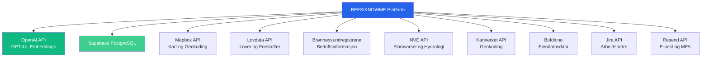
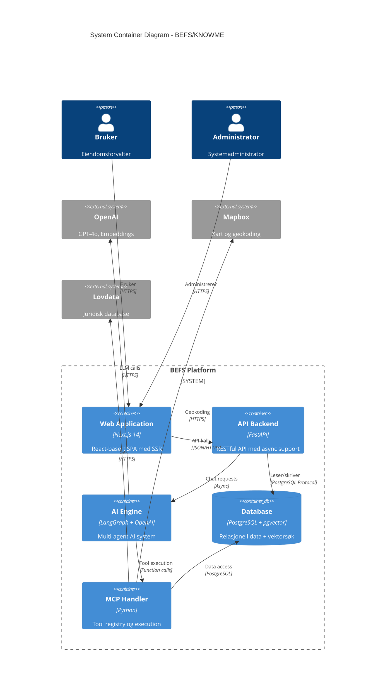
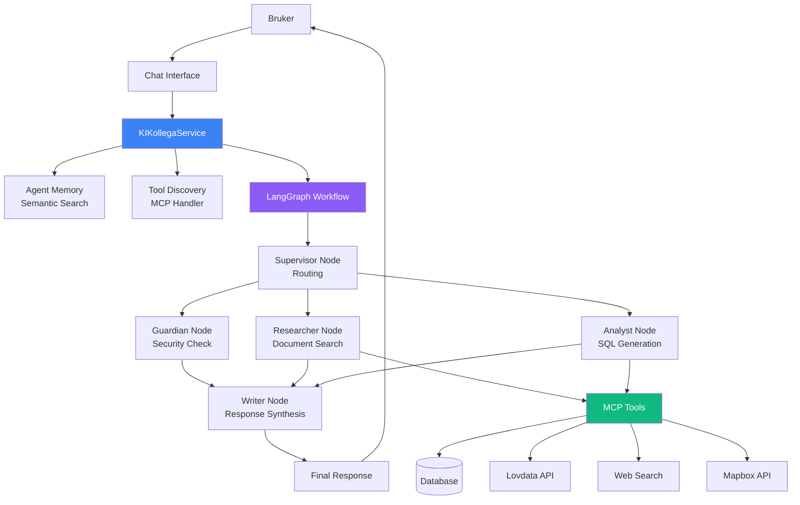
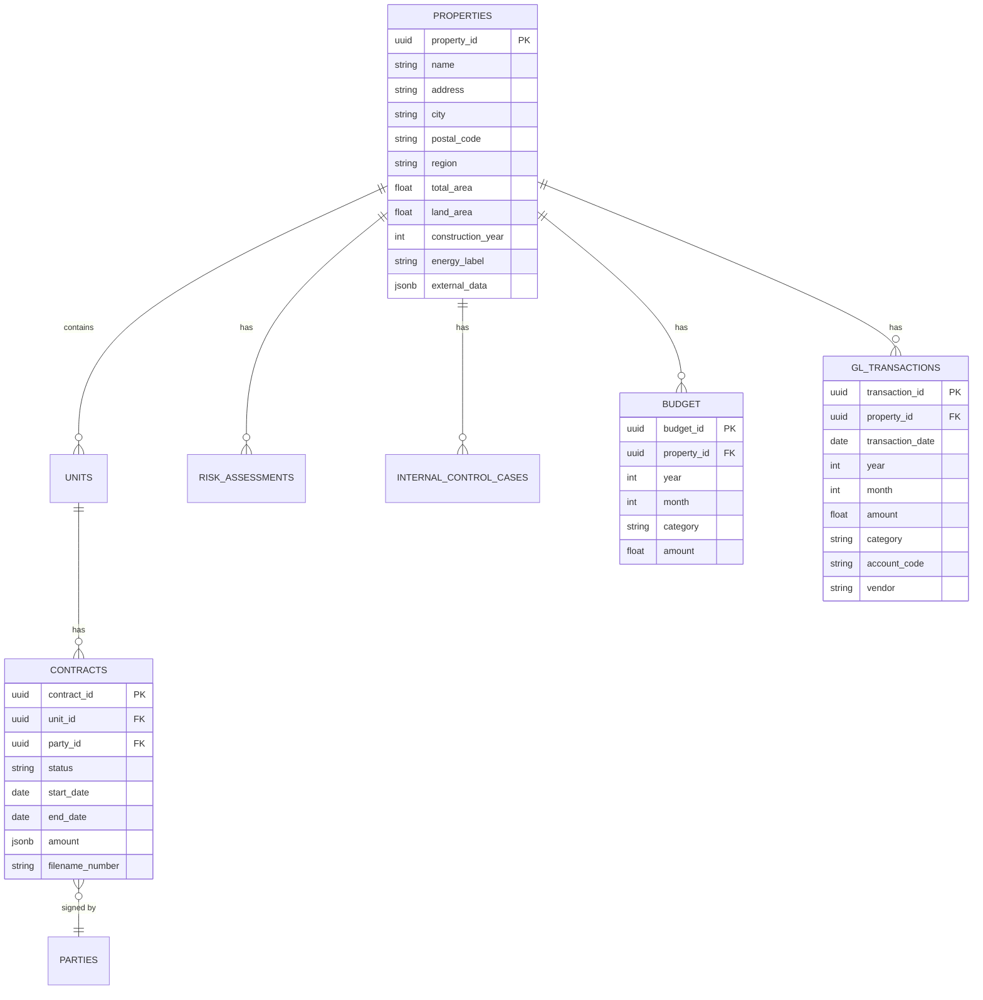
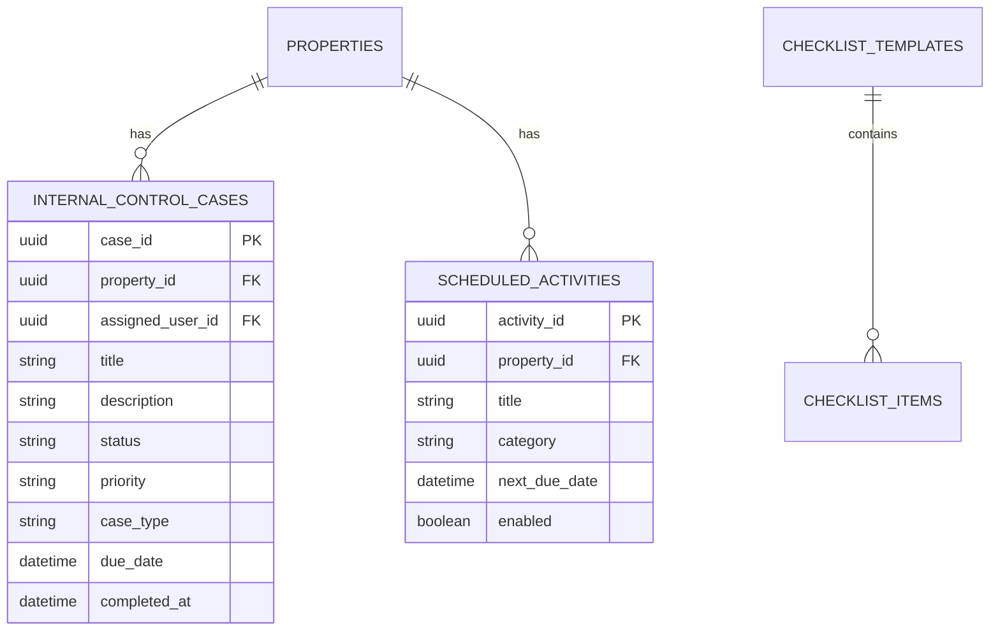
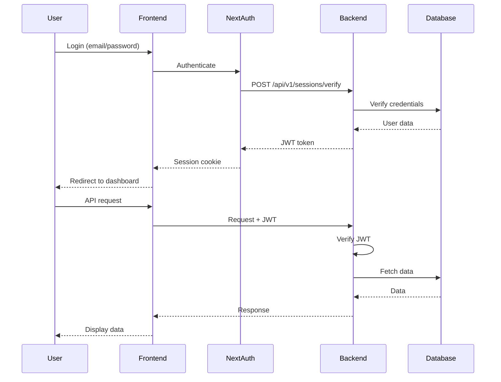
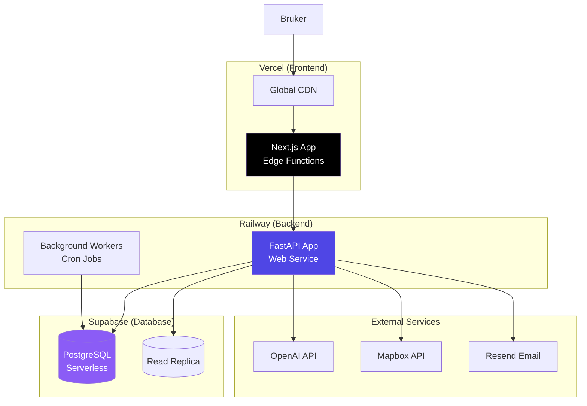

# BEFS/KNOWME - Komplett Arkitekturbeskrivelse

**Dokumenttype:** Arkitekturdokumentasjon  
**Versjon:** 1.0  
**Dato:** 12. februar 2026  
**Målgruppe:** Arkitekter, tekniske beslutningstakere, utviklere

---

## Innholdsfortegnelse

1. [Sammendrag](#1-sammendrag)
2. [Systemkontekst](#2-systemkontekst)
3. [Arkitekturprinsipper](#3-arkitekturprinsipper)
4. [Containere og Komponenter](#4-containere-og-komponenter)
5. [AI og Intelligens-lag](#5-ai-og-intelligens-lag)
6. [Dataarkitektur](#6-dataarkitektur)
7. [Integrasjoner](#7-integrasjoner)
8. [Sikkerhet](#8-sikkerhet)
9. [Deployment](#9-deployment)
10. [Skalerbarhet og Ytelse](#10-skalerbarhet-og-ytelse)
11. [Vedlikehold og Drift](#11-vedlikehold-og-drift)

---

## 1. Sammendrag

**BEFS** (Bufetat Eiendomsforvaltningssystem), også kjent som **KNOWME**, er en moderne cloud-native plattform for eiendomsforvaltning bygget med en tredelt arkitektur:

- **Frontend**: Next.js 14 (App Router) med TypeScript og Tailwind CSS
- **Backend**: Python FastAPI med asynkron arkitektur
- **Database**: PostgreSQL med pgvector for AI-funksjoner
- **AI-lag**: LangGraph multi-agent system med OpenAI GPT-4

### Nøkkelegenskaper

✅ **Cloud-native**: Serverless deployment på Vercel, Railway og Supabase  
✅ **AI-drevet**: Naturlig språk-grensesnitt via KI-Kollega  
✅ **Modulær**: Domain-Driven Design med klare grenser  
✅ **Skalerbar**: Asynkron arkitektur med connection pooling  
✅ **Sikker**: JWT-autentisering, MFA, GDPR-compliance  

---

## 2. Systemkontekst

### 2.1 Aktører

| Aktør | Rolle | Interaksjon |
|-------|-------|-------------|
| **Eiendomsforvaltere** | Primærbrukere | Administrerer eiendommer, kontrakter, HMS |
| **Økonomiansvarlige** | Sekundærbrukere | Budsjett, kostnadsanalyse, rapportering |
| **Administratorer** | Systemadministratorer | Brukeradministrasjon, konfigurasjon |
| **KI-Kollega** | AI-assistent | Besvarer spørsmål, utfører analyser |

### 2.2 Eksterne Systemer



### 2.3 Systemgrenser

**Innenfor systemgrenser:**
- Eiendomsregister og kontraktshåndtering
- Økonomisk analyse og budsjett
- HMS og internkontroll
- Risikovurdering
- AI-assistent (KI-Kollega)
- Dokumenthåndtering

**Utenfor systemgrenser:**
- Regnskapssystem (Unit4) - planlagt integrasjon
- Lønnssystem
- Ekstern dokumentarkivering
- Fysisk tilgangskontroll

---

## 3. Arkitekturprinsipper

### 3.1 Overordnede Prinsipper

1. **Cloud-First**: Alle komponenter er cloud-native og serverless der mulig
2. **API-First**: Alle funksjoner eksponeres via RESTful API
3. **Separation of Concerns**: Klar separasjon mellom presentasjon, forretningslogikk og data
4. **Async by Default**: Asynkron programmering for høy ytelse
5. **Security by Design**: Sikkerhet integrert fra grunnen av

### 3.2 Teknologivalg

| Beslutning | Valg | Begrunnelse |
|------------|------|-------------|
| **Frontend Framework** | Next.js 14 (App Router) | SSR, RSC, optimal ytelse, TypeScript-støtte |
| **Backend Framework** | FastAPI | Høy ytelse, async, automatisk OpenAPI-dokumentasjon |
| **Database** | PostgreSQL + pgvector | Relasjonell data + vektor-søk for AI |
| **AI Framework** | LangGraph | Strukturert multi-agent workflow, observability |
| **Deployment** | Vercel + Railway + Supabase | Serverless, auto-scaling, minimal ops |
| **Autentisering** | NextAuth + JWT | Industry standard, OAuth-støtte |

### 3.3 Arkitekturmønstre

- **Domain-Driven Design (DDD)**: Organisert i domener (core, hms, fdv, innsikt)
- **Repository Pattern**: Abstraksjon av datalag
- **Service Layer Pattern**: Forretningslogikk i services
- **Model Context Protocol (MCP)**: Standardisert AI-verktøyintegrasjon
- **CQRS-inspirert**: Separasjon av read/write operasjoner der hensiktsmessig

---

## 4. Containere og Komponenter

### 4.1 Container-oversikt



### 4.2 Backend Komponenter

#### 4.2.1 API Layer (`app/api/v1/`)

Organisert etter funksjonalitet:

```
app/api/v1/
├── ai/                    # AI og chat endpoints
│   ├── chat.py           # KI-Kollega chat
│   ├── assistant.py      # Legacy assistant
│   └── transparency.py   # AI transparency/explainability
├── admin/                # Admin-funksjoner
│   └── user_management.py
├── auth/                 # Autentisering
│   ├── login.py
│   ├── mfa.py
│   └── verification.py
├── mcp/                  # MCP servere
│   ├── gdpr.py
│   ├── risk.py
│   ├── document.py
│   └── ...
└── endpoints/            # Business endpoints
    ├── governance.py
    ├── glossary.py
    └── ...
```

#### 4.2.2 Domain Layer (`app/domains/`)

Domain-Driven Design struktur:

```
app/domains/
├── core/                 # Kjernedomene
│   ├── models/          # Property, Unit, Contract, Party
│   ├── routers/         # API endpoints
│   ├── services/        # Business logic
│   └── schemas/         # Pydantic models
├── hms/                 # HMS-domene
│   ├── models/          # Risk, Deviation, Checklist
│   ├── routers/
│   └── services/
├── fdv/                 # Drift og vedlikehold
│   ├── models/          # Component, MaintenancePlan
│   └── routers/
└── innsikt/             # Analyse og innsikt
    ├── routers/
    └── services/
```

#### 4.2.3 Service Layer (`app/services/`)

Spesialiserte tjenester:

| Service | Ansvar |
|---------|--------|
| `intelligence/` | AI-agenter og KI-Kollega |
| `mcp/` | MCP handler og tool registry |
| `external/` | Eksterne API-integrasjoner |
| `risk/` | Risikovurdering |
| `analytics/` | Analyse og rapportering |
| `search/` | Fulltekstsøk |
| `auth/` | Autentisering og autorisasjon |

### 4.3 Frontend Komponenter

#### 4.3.1 App Router Struktur

```
frontend/app/
├── (auth)/              # Auth-gruppe
│   ├── login/
│   └── verify-email/
├── dashboard/           # Hovedoversikt
├── properties/          # Eiendommer
│   └── [id]/           # Eiendomsdetaljer
├── contracts/           # Kontrakter
├── financials/          # Økonomi
├── risk/               # Risikovurdering
├── activities/         # HMS-aktiviteter
├── lab/                # AI Lab
└── components/         # Gjenbrukbare komponenter
    ├── ui/            # Shadcn/ui komponenter
    ├── maps/          # Kartkomponenter
    ├── charts/        # Visualisering
    └── forms/         # Skjemaer
```

#### 4.3.2 State Management

- **Server State**: React Query (TanStack Query) for API-data
- **Client State**: React Context for global UI-state
- **Form State**: React Hook Form med Zod-validering
- **Auth State**: NextAuth session management

---

## 5. AI og Intelligens-lag

### 5.1 KI-Kollega Arkitektur

KI-Kollega er bygget som et multi-agent system med LangGraph:



### 5.2 Agent-roller

| Agent | Ansvar | Input | Output |
|-------|--------|-------|--------|
| **Supervisor** | Ruter spørsmål til riktig agent | User query | Agent name |
| **Guardian** | Sikkerhetskontroll, blokkerer sensitive forespørsler | User query | Pass/Block |
| **Researcher** | Søker i dokumenter, Lovdata, web | Search query | Documents, sources |
| **Analyst** | Genererer og kjører SQL-spørringer | Natural language | SQL results |
| **Writer** | Syntetiserer svar med kilder | Agent outputs | Final response |

### 5.3 Model Context Protocol (MCP)

MCP er en fundamental arkitektonisk beslutning som gir:

**Arkitektur:**
```
KI-Kollega Agent
    ↓
MCP Handler (Tool Registry)
    ↓
┌─────────────┬─────────────┬─────────────┬─────────────┐
│ Database    │ Lovdata     │ Mapbox      │ Web Search  │
│ Tools       │ API         │ API         │ (DuckDuckGo)│
└─────────────┴─────────────┴─────────────┴─────────────┘
```

**Registrerte verktøy (50+):**

- **Database**: `execute_sql_query`, `lookup_properties`, `search_contracts`
- **Analyse**: `assess_property_risk`, `compare_contracts_by_price`
- **Eksterne**: `search_lovdata`, `search_web_tool`, `get_nearby_services`
- **HMS**: `create_work_order`, `check_internal_control`
- **Dokumentasjon**: `search_documents`, `list_help_articles`

**Fordeler:**
- ✅ Standardisert grensesnitt for alle verktøy
- ✅ Dynamisk verktøyoppdagelse
- ✅ Input-validering og rate limiting
- ✅ Audit logging
- ✅ Enkel å legge til nye integrasjoner

### 5.4 SQL-generering med DSPy

**Hybrid strategi:**
- Enkle spørringer → `gpt-4o-mini` (rask, billig)
- Komplekse spørringer → `gpt-4o` (høy kvalitet)
- Automatisk kompleksitetsdeteksjon
- Retry-logikk ved feil

**Sikkerhet:**
- Read-only validering (blokkerer DROP, DELETE, INSERT)
- Rate limiting (10 queries/minutt)
- SQL injection-beskyttelse
- Timeout-håndtering (45 sekunder)

### 5.5 Memory System

**Agent Memory:**
- Semantisk søk med pgvector
- Lagrer tidligere interaksjoner
- Kontekstbevisst (husker hva brukeren ser på)
- TTL-basert utløp

**Query Library:**
- Lagrede SQL-mønstre
- Gjenbruk av vellykkede queries
- Cache med 75% hit rate

---

## 6. Dataarkitektur

### 6.1 Database Schema

#### Kjernetabeller



#### HMS og Internkontroll



### 6.2 JSONB-bruk

PostgreSQL JSONB brukes for fleksible data:

**`properties.external_data`:**
```json
{
  "financials": {
    "total_manual_expenses": 50000,
    "total_spend_csv": 75000,
    "cost_summary": 125000
  },
  "proximity": {
    "nearest_hospital": {"distance": 2.5, "name": "Oslo Universitetssykehus"}
  }
}
```

**`contracts.amount`:**
```json
{
  "amount_per_year": 1200000,
  "amount_per_month": 100000,
  "currency": "NOK"
}
```

### 6.3 Vektorsøk (pgvector)

**Agent Memory:**
```sql
CREATE TABLE agent_memory (
    memory_id UUID PRIMARY KEY,
    content TEXT,
    embedding vector(1536),  -- OpenAI ada-002
    metadata JSONB,
    created_at TIMESTAMP
);

CREATE INDEX ON agent_memory USING ivfflat (embedding vector_cosine_ops);
```

**Semantisk søk:**
```python
# Finn relevante minner
results = await db.execute(
    select(AgentMemory)
    .order_by(AgentMemory.embedding.cosine_distance(query_embedding))
    .limit(5)
)
```

---

## 7. Integrasjoner

### 7.1 Eksterne API-er

| Tjeneste | Formål | Protokoll | Autentisering |
|----------|--------|-----------|---------------|
| **OpenAI** | LLM, embeddings | REST/HTTPS | API Key |
| **Mapbox** | Kart, geokoding | REST/HTTPS | Access Token |
| **Lovdata** | Juridisk søk | REST/HTTPS | API Key |
| **Brønnøysundregistrene** | Bedriftsinfo | REST/HTTPS | Ingen (åpen) |
| **NVE** | Flomvarsel | REST/HTTPS | Ingen (åpen) |
| **Kartverket** | Geokoding | REST/HTTPS | Ingen (åpen) |
| **Jira** | Arbeidsordre | REST/HTTPS | OAuth 2.0 |
| **Resend** | E-post, MFA | REST/HTTPS | API Key |

### 7.2 Integrasjonsmønstre

**Async HTTP Client:**
```python
class ExternalAPIClient:
    def __init__(self):
        self.client = httpx.AsyncClient(timeout=30.0)
    
    async def call_api(self, url: str, **kwargs):
        # Retry-logikk
        for attempt in range(3):
            try:
                response = await self.client.get(url, **kwargs)
                response.raise_for_status()
                return response.json()
            except httpx.HTTPError as e:
                if attempt == 2:
                    raise
                await asyncio.sleep(2 ** attempt)
```

**Rate Limiting:**
```python
from slowapi import Limiter

limiter = Limiter(key_func=get_remote_address)

@app.get("/api/v1/expensive-operation")
@limiter.limit("10/minute")
async def expensive_operation():
    ...
```

### 7.3 Webhook-støtte

**Jira Webhooks:**
- Mottar notifikasjoner om issue-endringer
- Oppdaterer lokale arbeidsordre
- Trigger notifikasjoner til brukere

---

## 8. Sikkerhet

### 8.1 Autentisering og Autorisasjon

**NextAuth Flow:**


**JWT Claims:**
```json
{
  "sub": "user-uuid",
  "email": "user@example.com",
  "role": "user",
  "iat": 1707739200,
  "exp": 1707825600
}
```

### 8.2 Sikkerhetslag

| Lag | Mekanisme | Beskrivelse |
|-----|-----------|-------------|
| **Transport** | HTTPS/TLS 1.3 | All kommunikasjon kryptert |
| **Autentisering** | JWT + MFA | Multi-faktor autentisering |
| **Autorisasjon** | RBAC | Role-based access control |
| **Input-validering** | Pydantic | Schema-validering på alle endpoints |
| **SQL Injection** | SQLAlchemy ORM | Parametriserte queries |
| **XSS** | React | Automatisk escaping |
| **CSRF** | SameSite cookies | CSRF-beskyttelse |
| **Rate Limiting** | SlowAPI | DDoS-beskyttelse |

### 8.3 GDPR-compliance

**Personvernfunksjoner:**
- Anonymisering av persondata
- Rett til sletting
- Dataportabilitet
- Audit logging av datahåndtering
- Kryptering av sensitive felt

**GDPR MCP Server:**
```python
@mcp_handler.register_tool(
    name="check_gdpr_compliance",
    description="Sjekk GDPR-compliance for en eiendom"
)
async def check_gdpr_compliance(property_id: str):
    # Sjekk for persondata
    # Verifiser samtykke
    # Returner compliance-status
    ...
```

---

## 9. Deployment

### 9.1 Deployment-arkitektur



### 9.2 Miljøer

| Miljø | Frontend | Backend | Database | Formål |
|-------|----------|---------|----------|--------|
| **Lokal** | localhost:3000 | localhost:8000 | Lokal PostgreSQL | Utvikling |
| **Staging** | preview.vercel.app | railway.app | Supabase staging | Testing |
| **Produksjon** | knowme.vercel.app | knowme-backend-production.up.railway.app | Supabase prod | Live |

### 9.3 CI/CD Pipeline

**GitHub Actions:**
```yaml
name: Deploy
on:
  push:
    branches: [main]

jobs:
  deploy-frontend:
    runs-on: ubuntu-latest
    steps:
      - uses: actions/checkout@v3
      - name: Deploy to Vercel
        run: vercel deploy --prod
  
  deploy-backend:
    runs-on: ubuntu-latest
    steps:
      - uses: actions/checkout@v3
      - name: Trigger Railway Deploy
        run: curl -X POST $RAILWAY_DEPLOY_HOOK
```

**Database Migrations:**
```bash
# Alembic migrations
alembic revision --autogenerate -m "Add new table"
alembic upgrade head
```

### 9.4 Infrastruktur som Kode

**Railway Configuration:**
```yaml
services:
  - type: web
    name: befs-backend
    env: python
    buildCommand: pip install -r requirements.txt
    startCommand: uvicorn app.main:app --host 0.0.0.0 --port $PORT
    healthCheckPath: /api/v1/health
    envVars:
      - key: DATABASE_URL
        sync: false
      - key: OPENAI_API_KEY
        sync: false
```

---

## 10. Skalerbarhet og Ytelse

### 10.1 Skaleringsstrategier

**Horisontal Skalering:**
- Frontend: Automatisk via Vercel Edge Network
- Backend: Auto-scaling på Railway
- Database: Supabase

**Vertikal Skalering:**
- Backend: Upgrade til større Railway-plan ved behov
- Database: Supabase Pro plan med mer compute

### 10.2 Ytelsesoptimalisering

**Frontend:**
- Server-Side Rendering (SSR) for rask initial load
- React Server Components for redusert bundle size
- Image optimization med Next.js Image
- Code splitting og lazy loading
- CDN-caching av statiske assets

**Backend:**
- Async/await for høy concurrency
- Connection pooling (pool_size=3, max_overflow=7)
- Database query optimization (indexes, EXPLAIN ANALYZE)
- Response caching for ofte brukte queries
- Batch operations for bulk updates

**Database:**
- Indexes på ofte brukte kolonner
- JSONB GIN-indexes for rask søk
- IVFFlat index for vektorsøk
- Query result caching
- Read replicas for read-heavy workloads

### 10.3 Monitoring og Observability

**Metrics:**
- Response times (p50, p95, p99)
- Error rates
- Database connection pool usage
- AI token usage og kostnad
- Cache hit rates

**Logging:**
```python
import logging

logger = logging.getLogger("app.service")

logger.info("Processing request", extra={
    "user_id": user_id,
    "property_id": property_id,
    "duration_ms": duration
})
```

**Health Checks:**
```python
@app.get("/api/v1/health")
async def health_check():
    return {
        "status": "healthy",
        "db": await check_db_connection(),
        "ai": await check_openai_connection(),
        "version": "1.0.0"
    }
```

---

## 11. Vedlikehold og Drift

### 11.1 Backup og Disaster Recovery

**Database Backup:**
- Supabase: Automatisk daglig backup med 7-dagers retention
- Point-in-time recovery (PITR) siste 7 dager
- Manual snapshots før større endringer

**Disaster Recovery Plan:**
1. Database restore fra backup (RTO: 1 time)
2. Redeploy backend fra git (RTO: 10 minutter)
3. Redeploy frontend fra git (RTO: 5 minutter)
4. Verifiser funksjonalitet med smoke tests

### 11.2 Vedlikeholdsoppgaver

**Daglig:**
- Automated health checks
- Error log monitoring
- Performance metrics review

**Ukentlig:**
- Database vacuum og analyze
- Dependency updates (Dependabot)
- Security scanning (Snyk)

**Månedlig:**
- Database backup verification
- Disaster recovery drill
- Performance optimization review
- Cost optimization review

### 11.3 Dokumentasjon

**Teknisk dokumentasjon:**
- API-dokumentasjon (OpenAPI/Swagger)
- Database schema (SCHEMA.md)
- Arkitekturdokumentasjon (dette dokumentet)
- Deployment-guider

**Brukerdokumentasjon:**
- Brukerhjelp (BRUKERHJELP.md)
- Admin-guide
- FAQ

### 11.4 Support og Feilsøking

**Logging-strategi:**
- Strukturert logging med JSON
- Log levels: DEBUG, INFO, WARNING, ERROR, CRITICAL
- Correlation IDs for request tracking
- Sensitive data masking

**Feilsøkingsverktøy:**
- Database query analyzer
- AI transparency endpoint
- Audit logs
- Health check endpoints

---

## Vedlegg A: Teknologi-stack Oversikt

### Backend
- **Python**: 3.11+
- **FastAPI**: 0.109+
- **SQLAlchemy**: 2.0+ (async)
- **Alembic**: Database migrations
- **Pydantic**: Data validation
- **LangGraph**: AI workflow orchestration
- **DSPy**: Structured LLM programming
- **httpx**: Async HTTP client
- **Uvicorn**: ASGI server

### Frontend
- **Next.js**: 14+ (App Router)
- **React**: 18+
- **TypeScript**: 5+
- **Tailwind CSS**: 3+
- **Shadcn/ui**: Component library
- **React Query**: Server state management
- **React Hook Form**: Form handling
- **Zod**: Schema validation
- **Mapbox GL JS**: Maps

### Database
- **PostgreSQL**: 15+
- **pgvector**: Vector similarity search
- **PostGIS**: Spatial data (planned)

### Infrastructure
- **Vercel**: Frontend hosting
- **Railway**: Backend hosting
- **Supabase**: PostgreSQL
- **GitHub Actions**: CI/CD

### External Services
- **OpenAI**: GPT-4o, text-embedding-ada-002
- **Mapbox**: Maps and geocoding
- **Resend**: Email delivery
- **Lovdata**: Legal database

---

## Vedlegg B: Nøkkelmetrikker

### Ytelse
- **Frontend TTFB**: < 200ms (p95)
- **API Response Time**: < 500ms (p95)
- **Database Query Time**: < 100ms (p95)
- **AI Response Time**: < 10s (p95)

### Tilgjengelighet
- **Uptime SLA**: 99.5%
- **Planned Downtime**: < 4 timer/måned
- **RTO (Recovery Time Objective)**: 1 time
- **RPO (Recovery Point Objective)**: 24 timer

### Sikkerhet
- **Failed Login Attempts**: < 0.1%
- **Security Incidents**: 0 (target)
- **Vulnerability Patching**: < 7 dager

---

**Dokumenteier:** Teknisk arkitekt  
**Sist oppdatert:** 12. februar 2026  
**Neste review:** 12. mai 2026
