# BEFS/KNOWME - Arkitekturdiagrammer

**Dokumenttype:** Arkitekturdiagrammer  
**Versjon:** 1.0  
**Dato:** 12. februar 2026  
**Målgruppe:** Arkitekter, tekniske beslutningstakere

---

## Innholdsfortegnelse

1. [Systemkontekst-diagram](#1-systemkontekst-diagram)
2. [Container-diagram](#2-container-diagram)
3. [Komponent-diagram - Backend](#3-komponent-diagram---backend)
4. [Komponent-diagram - Frontend](#4-komponent-diagram---frontend)
5. [AI Agent Workflow](#5-ai-agent-workflow)
6. [Dataflyt-diagram](#6-dataflyt-diagram)
7. [Deployment-arkitektur](#7-deployment-arkitektur)
8. [Sikkerhetsarkitektur](#8-sikkerhetsarkitektur)
9. [Integrasjonsarkitektur](#9-integrasjonsarkitektur)

---

## 1. Systemkontekst-diagram

Dette diagrammet viser BEFS/KNOWME i kontekst med eksterne systemer og brukere.

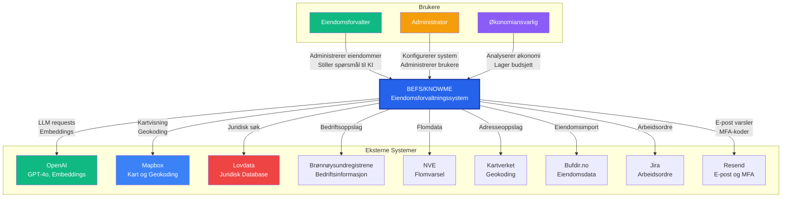

### Beskrivelse

**BEFS/KNOWME** er det sentrale systemet som:
- Håndterer eiendomsforvaltning, kontrakter og økonomi
- Tilbyr AI-assistent (KI-Kollega) for naturlig språk-interaksjon
- Integrerer med 9 eksterne systemer for berikelse av data

---

## 2. Container-diagram

Dette diagrammet viser de viktigste containerene i BEFS-arkitekturen.

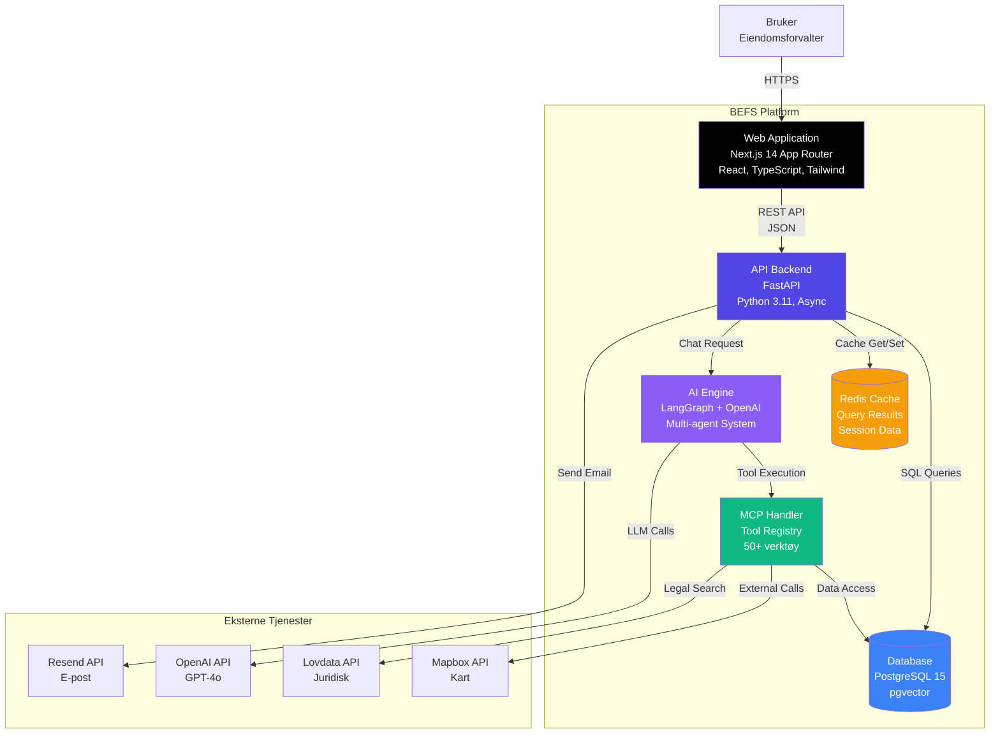

### Container-beskrivelser

| Container | Teknologi | Ansvar |
|-----------|-----------|--------|
| **Web Application** | Next.js 14, React, TypeScript | SPA med SSR, brukergrensesnitt |
| **API Backend** | FastAPI, Python 3.11 | RESTful API, forretningslogikk |
| **AI Engine** | LangGraph, OpenAI | Multi-agent AI-system |
| **MCP Handler** | Python | Tool registry og execution |
| **Database** | PostgreSQL 15 + pgvector | Persistent lagring, vektorsøk |
| **Cache** | Redis | Session cache, query results |

---

## 3. Komponent-diagram - Backend

Dette diagrammet viser backend-komponentene i detalj.

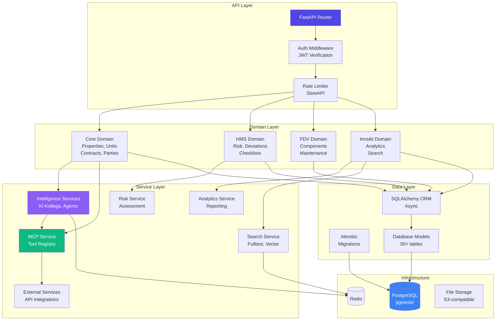

### Komponent-beskrivelser

**API Layer:**
- Router: Endpoint-routing og request handling
- Auth Middleware: JWT-validering og autorisasjon
- Rate Limiter: DDoS-beskyttelse

**Domain Layer (DDD):**
- Core: Kjernedomene (eiendommer, kontrakter)
- HMS: Helse, miljø og sikkerhet
- FDV: Forvaltning, drift og vedlikehold
- Innsikt: Analyse og søk

**Service Layer:**
- Intelligence: AI-agenter og KI-Kollega
- MCP Service: Tool registry og execution
- External: Eksterne API-integrasjoner
- Risk: Risikovurdering
- Analytics: Rapportering og analyse
- Search: Fulltekstsøk og vektorsøk

---

## 4. Komponent-diagram - Frontend

Dette diagrammet viser frontend-komponentene.

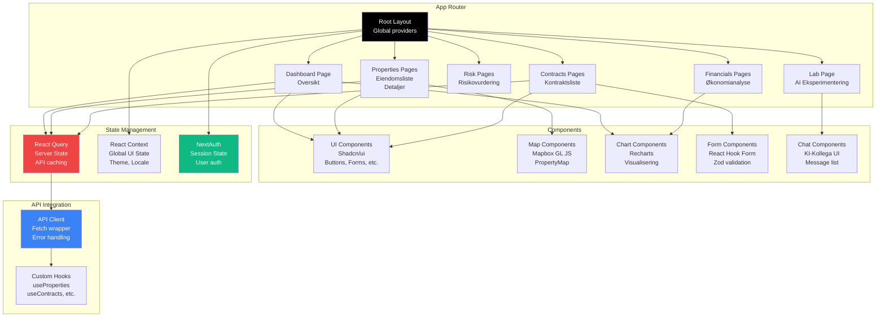

---

## 5. AI Agent Workflow

Dette diagrammet viser KI-Kollega's multi-agent workflow.

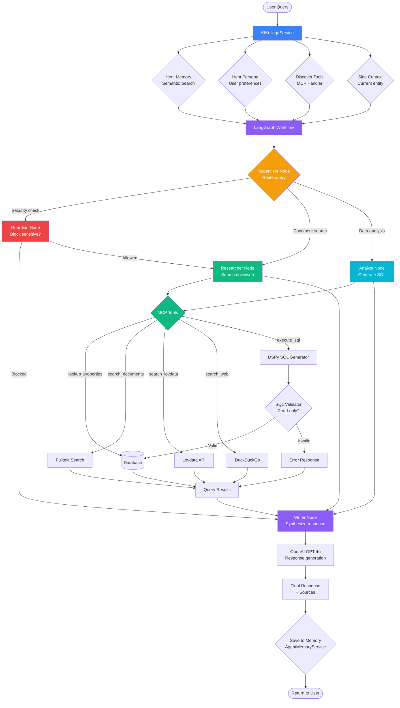

### Agent-roller

| Agent | Trigger | Ansvar | Output |
|-------|---------|--------|--------|
| **Supervisor** | Alltid først | Ruter spørsmål til riktig agent | Agent name |
| **Guardian** | Sensitive spørsmål | Blokkerer upassende forespørsler | Pass/Block |
| **Researcher** | "Finn", "Søk", "Hva er" | Søker i dokumenter, web, Lovdata | Documents + sources |
| **Analyst** | "Hvor mange", "Gjennomsnitt", "Topp 10" | Genererer og kjører SQL | Query results + SQL |
| **Writer** | Alltid sist | Syntetiserer svar fra agenter | Final response |

---

## 6. Dataflyt-diagram

### 6.1 Bruker Logger Inn

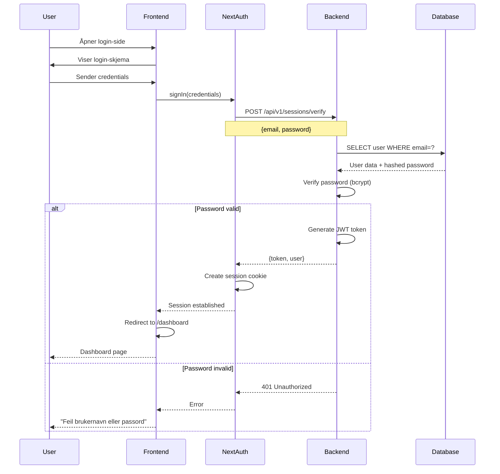

### 6.2 Bruker Stiller Spørsmål til KI-Kollega

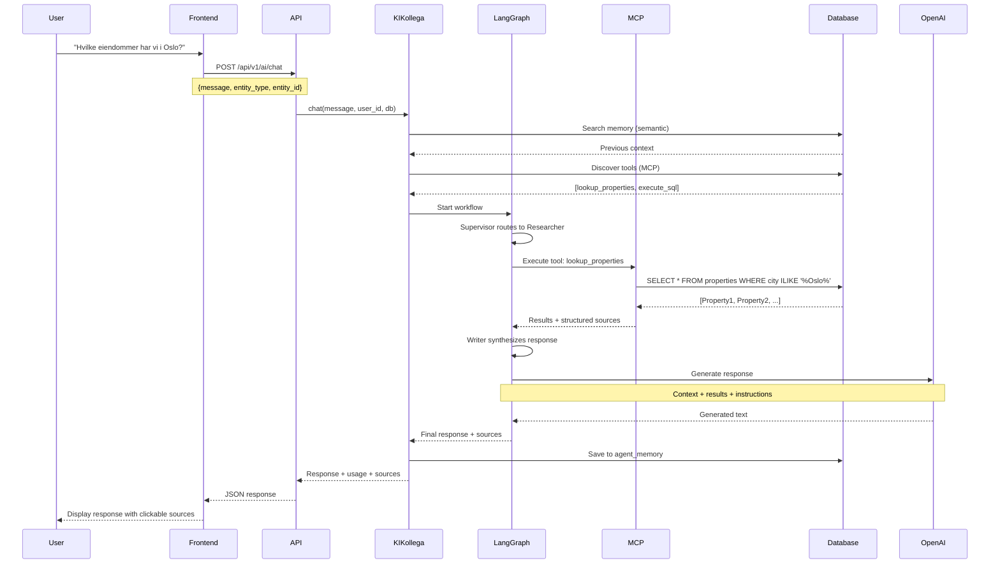

### 6.3 Budsjett Genereres

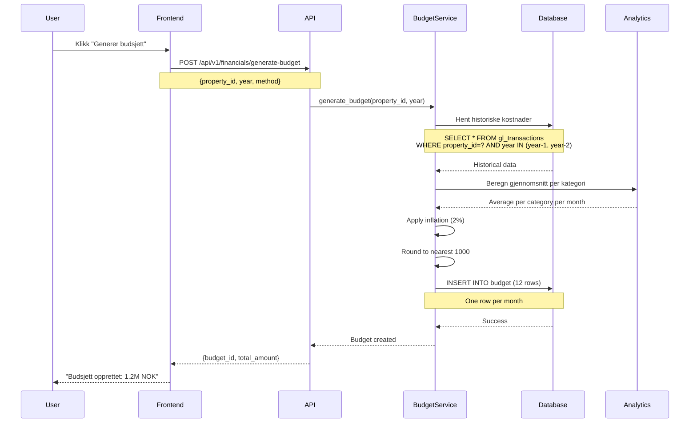

---

## 7. Deployment-arkitektur

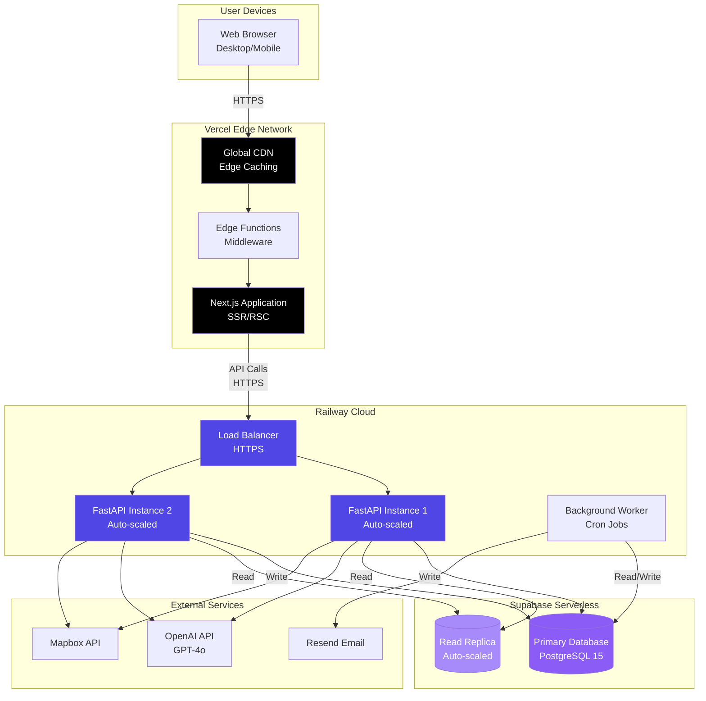

### Deployment-detaljer

| Komponent | Platform | Skalering | Region |
|-----------|----------|-----------|--------|
| **Frontend** | Vercel | Auto (Edge) | Global CDN |
| **Backend** | Railway | Auto | EU West |
| **Database** | Supabase | Auto | EU West |
| **Cache** | Redis (planned) | Manual | EU West |

---

## 8. Sikkerhetsarkitektur

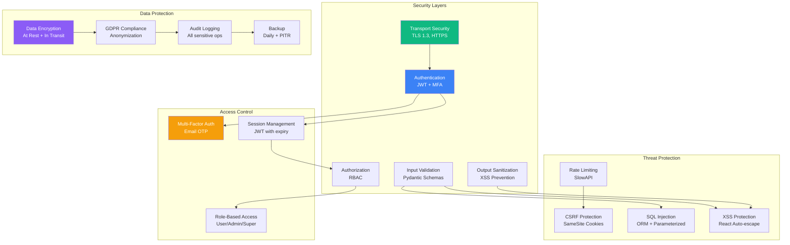

### Sikkerhetslag

1. **Transport**: TLS 1.3, HTTPS everywhere
2. **Autentisering**: JWT tokens med MFA
3. **Autorisasjon**: Role-based access control
4. **Input-validering**: Pydantic schemas på alle endpoints
5. **Rate limiting**: DDoS-beskyttelse
6. **Data-kryptering**: At rest og in transit
7. **Audit logging**: Alle sensitive operasjoner

---

## 9. Integrasjonsarkitektur

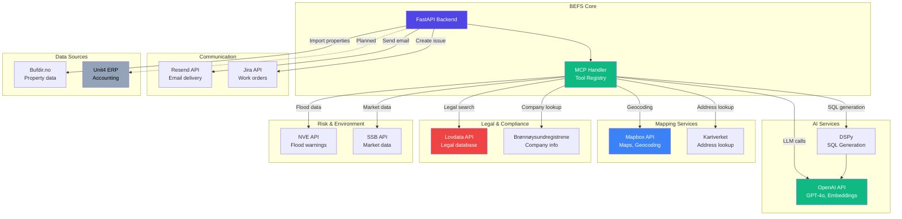

### Integrasjonsmønstre

| Tjeneste | Mønster | Retry | Timeout | Cache |
|----------|---------|-------|---------|-------|
| **OpenAI** | Async HTTP | 3x exponential | 30s | Query results |
| **Mapbox** | Async HTTP | 3x exponential | 10s | Geocoding results |
| **Lovdata** | Async HTTP | 2x linear | 15s | Search results |
| **BRREG** | Async HTTP | 3x exponential | 10s | Company data |
| **NVE** | Async HTTP | 2x linear | 10s | Flood data |
| **Jira** | Webhook + API | 3x exponential | 20s | None |
| **Resend** | Async HTTP | 3x exponential | 10s | None |

---

## Vedlegg: Diagram-notasjon

### Fargekoder

- 🔵 **Blå**: Backend-komponenter
- 🟣 **Lilla**: AI/Intelligence-komponenter
- 🟢 **Grønn**: Eksterne tjenester
- 🟡 **Gul**: Cache/Middleware
- 🔴 **Rød**: Sikkerhetskritiske komponenter
- ⚫ **Svart**: Frontend-komponenter

### Symboler

- **Rektangel**: Komponent/Container
- **Sylinder**: Database
- **Diamant**: Beslutningspunkt
- **Sirkel**: Start/Slutt
- **Pil**: Dataflyt/Avhengighet

---

**Dokumenteier:** Teknisk arkitekt  
**Sist oppdatert:** 12. februar 2026  
**Neste review:** 12. mai 2026
