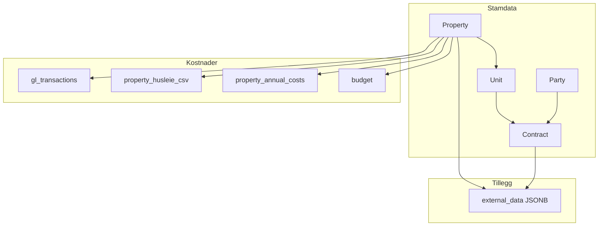

# Begrepsforståelse og dataordliste – BEFS

Dette dokumentet etablerer en total begrepsforståelse og system for alle datafelt i løsningen. Bruk det før import og ved feilsøking.

---

## 1. Overordnet datamodell



---

## 2. Eiendommer (properties)

| Felt | Type | Definisjon | Kilde | Merknad |
|------|------|------------|-------|---------|
| `property_id` | UUID | Unik identifikator | System | Auto-generert |
| `lokalisering_id` | String | Lokaliseringkode (f.eks. 6125, 4711) | Eie1212, Oversikt bygg | Brukes til matching |
| `name` | String | Eiendomsnavn | Eie1212, Oversikt bygg | F.eks. "Furuly", "Storgata 10" |
| `description` | String | Sammendrag/beskrivelse for visning | Oversikt bygg | Aggregert fra avtalenavn, vises i eiendomskort. Se [Avtalenavn](#avtalenavn-til-description). |
| `address` | String | Gateadresse | Eie1212, Oversikt bygg | Adresselinje 1 |
| `postal_code` | String(4) | Postnummer | Eie1212 | 4 siffer |
| `city` | String | Poststed | Eie1212 | |
| `region` | String | Driftsregion | Eie1212, Oversikt bygg | **Standard:** Nord, Midt-Norge, Vest, Sør, Øst, Bufdir (se [REGION_STANDARD.md](REGION_STANDARD.md)) |
| `area` | String | Geografisk område innenfor region | Oversikt bygg | Lok: Område. Vises i eiendomskort sammen med region. Se [Lok: Område](#lok-område). |
| `total_area` | Float | Totalt areal m² | Eie1212 | Bruttoareal |
| `land_area` | Float | Tomteareal m² | Eie1212 | |
| `usage` | String | Brukstype | Eie1212 | F.eks. Næringseiendom |
| `construction_year` | Integer | Byggeår | Eie1212 | |
| `energy_label` | String | Energimerking | Ekstern | A–G |
| `municipality` | String | Kommune | Eie1212 | |
| `municipality_code` | String | Kommunenummer | Eie1212 | |
| `gnr` | Integer | Gårdsnummer | Eie1212 | |
| `bnr` | Integer | Bruksnummer | Eie1212 | |
| `approved_places` | Integer | Antall kvalitetssikrede plasser (pr. 01.01) | Oversikt bygg, institusjons-CSV | Se nedenfor |
| `budgeted_places` | Integer | Antall budsjetterte plasser (pr. 01.01) | Oversikt bygg, institusjons-CSV | Se nedenfor |
| `affiliation` | String | Målgruppe/tilhørighet | Oversikt bygg | FVK, BFS, Kontor, Akutt, Omsorg |
| `legal_basis` | String | Hjemmel § | Oversikt bygg | Lovparagrafer |
| `regulation_type` | String | Årlig prisjusteringsfaktaktor | Oversikt bygg | F.eks. "100% KPI" |
| `unit_id_erp` | String | EnhetID (ERP/e-don2) | e-don2 | **Kobling til regnskap:** `department_code` i gl_transactions |
| `unit_short_type` | String | Enhetskorttype | e-don2 | Avdeling | Barnevernsinstitusjon |
| `unit_type_derived` | String | Enhetstype (utledet) | e-don2 | Barnevernsinstitusjon, Institusjonsavdeling, Omsorgssenter |
| `parent_unit_id_erp` | String | TilhørighetEnhetID | e-don2 | Organisatorisk forelder |
| `department_code` | String | Avdelingens koststed | Institusjons-CSV, Oversikt bygg | 1:1 med institusjon. Kobling til GL Dim1. |
| `department_name` | String | Navn på avdeling | Institusjons-CSV, Oversikt bygg | 1:1 med institusjon. Avdelingsnavn. |
| `ownership_type` | String | Eierskapenhet | e-don2 | |
| `owner_name` | String | Hjemmelshaver | e-don2 | |
| `org_number` | String | Org.nr utleier/hjemmelshaver | e-don2 | |
| `closed_at` | DateTime | Nedlagt dato | e-don2 | Eiendom nedlagt |
| `project_phase` | String | Prosjektfase | e-don2 | B2–B4 |
| `project_comments` | String | Prosjektkommentarer | e-don2 | |
| `center_id` | String | Tilhørende senter | e-don2 | FK til centers |
| `full_address` | JSONB | Strukturert adresse | Import | |
| `crisis_contacts` | JSONB | Nødskontakter | Import | |
| `external_data` | JSONB | Tilleggsdata | Se nedenfor | |

### Kvalitetssikrede og budsjetterte plasser

Både `approved_places` og `budgeted_places` er tekniske nøkkeltall for **styring og rapportering** av barnevernsinstitusjoner. Brukes for kapasitet, økonomi og om plassene oppfyller lovpålagte krav.

| Begrep | BEFS-felt | Fokus | Spørsmål det besvarer |
|--------|-----------|-------|------------------------|
| **Kvalitetssikrede plasser** | `approved_places` | Lovlighet og faglig standard | «Hvor mange barn har vi lov og mulighet til å ta imot i dag?» |
| **Budsjetterte plasser** | `budgeted_places` | Økonomi og planlegging | «Hvor mange plasser har vi satt av penger til å betale for i år?» |

**Kvalitetssikrede plasser** = antall plasser som er godkjente og klare til bruk ved årets start.
- Kvalitetssikring = oppfyllelse av *forskrift om godkjenning og tilsyn* (bemanning, kompetanse, lokaler, institusjonsplan).
- Viser faktisk, lovlig kapasitet for plassering av barn og unge.

**Budsjetterte plasser** = økonomisk styringstall.
- Antall plasser myndighetene har planlagt og satt av penger til å drifte.
- Kan avvike fra kvalitetssikrede (f.eks. budsjett til 10, men bare 8 kvalitetssikret).
- Brukes til kostnad per plass og økonomisk planlegging.

**Dato 01.01** brukes som et «stillbilde» for år-til-år sammenligning i offisiell statistikk (SSB, årsmeldinger).

### properties.external_data

| Nøkkel | Definisjon | Kilde |
|-------|------------|-------|
| `financials` | Økonomisk data (legacy) | CSV-import, manuell |
| `financials.total_manual_expenses` | Manuelt registrerte utgifter | Manuell |
| `financials.total_spend_csv` | Sum fra CSV-import | Tidligere import |
| `financials.manual_expenses` | Array av utgiftsposter | Manuell |
| `financials.gl_by_category` | GL-transaksjoner gruppert | Avledet |
| `financials.rent_summary` | Leieoppsummering | Syntetisk |
| `financials.synthetic_rent_ytd` | Syntetisk leie (YTD) | Syntetisk |
| `lok_omraade` | Lok: Område – geografisk underområde | Oversikt bygg | Avklar semantikk |
| `egnethet_lokalisering` | Egnethet lokalisering (skala 1–4, rød–grønn) | Oversikt bygg |
| `egnethet_bygg` | Egnethet bygg (skala 1–4) | Oversikt bygg |
| `priortert_viderfort` | Prioritert viderført/utviklet (Ja/Nei eller beskrivelse) | Oversikt bygg |
| `aar_videreutvikling` | År for videreutvikling | Oversikt bygg |
| `kostnader_videreutvikling` | Kostnader til videreutvikling (NOK) | Oversikt bygg |
| `bufdir` | Bufdir-institusjon | Bufdir |
| `bufdir_institution` | Bufdir-institusjon (alt) | Bufdir |
| `aliases` | Alternativnavn for matching | Import | Array. **Viktig:** Institusjonsnavn varierer mellom CSV-kilder – lagre alle forekomster her slik at matching fungerer ved senere import. |
| `master_data` | Masterdata fra Elements | Elements |
| `birk` | BIRK-organisasjon | BIRK |

---

## 3. Avdelinger (units)

| Felt | Type | Definisjon | Kilde |
|------|------|------------|-------|
| `unit_id` | UUID | Unik identifikator | System |
| `property_id` | UUID | Tilhørende eiendom | Eie1212 |
| `address` | String | Enhetsadresse | Eie1212 |
| `purpose` | String | Formål | Eie1212 |
| `area_sqm` | Float | Areal m² | Eie1212 |
| `floor` | Integer | Etasje | Eie1212 |
| `zone_type` | String | Sone | Statsbygg | ANSA, BEBO |
| `uu_compliant` | Boolean | Universell utforming | Statsbygg | |
| `uu_notes` | String | UU-notater | Statsbygg | |
| `external_data` | JSON | Tilleggsdata | Import |

### units.external_data

| Nøkkel | Definisjon |
|-------|------------|
| `area` | Areal m² |
| `usage_type` | Brukstype (Kontor, Bolig, etc.) |
| `master_data` | Masterdata |

---

## 4. Kontrakter (contracts)

| Felt | Type | Definisjon | Kilde |
|------|------|------------|-------|
| `contract_id` | UUID | Unik identifikator | System |
| `contract_name` | String | **Avtalenavn** fra CSV | Oversikt bygg | Beskriver leieforholdet, f.eks. "Vestfold Inntak 3.etg". Én eiendom kan ha flere kontrakter. |
| `archive_code` | String(50) | **Arkivkode** – BUF-LOK-YYYYMMDD-NN | Import/System | Se [ARKIVKODE_OG_REFERANSEKODE_STANDARD.md](ARKIVKODE_OG_REFERANSEKODE_STANDARD.md) |
| `unit_id` | UUID | Utleieobjekt | Eie1212 |
| `party_id` | UUID | Utleier/part | Eie1212 |
| `status` | String | Kontraktstatus | Eie1212 | **active** | **terminated** (lowercase) |
| `category` | String | Kontraktstype (enhetlig) | Eie1212, Oversikt bygg | Leiekontrakt, Tilleggskontrakt, Serviceavtale, Parkeringsavtale, Annet |
| `start_date` | Date | Startdato | Eie1212 |
| `end_date` | Date | Sluttdato | Eie1212 |
| `amount` | JSONB | Økonomiske data | Se nedenfor |
| `signed_at` | DateTime | Signert dato | Eie1212 |
| `terminated_at` | DateTime | Avsluttet dato | Eie1212 |
| `has_option` | Boolean | Har opsjon | Oversikt bygg |
| `option_deadline` | Date | Varslingsfrist | Oversikt bygg |
| `option_count_total` | Integer | Antall opsjoner | Oversikt bygg |
| `option_count_used` | Integer | Opsjoner benyttet | Oversikt bygg |
| `caretaker_cost` | Float | Vaktmestertjenester kr/år | Oversikt bygg |
| `cleaning_cost` | Float | Renhold kr/år | Oversikt bygg |
| `parking_cost` | Float | Parkeringsleie kr/år | Oversikt bygg |
| `card_reader_cost` | Float | Kortleser kr/år | Oversikt bygg |
| `external_data` | JSONB | Tilleggsdata | Se nedenfor |

### contracts.amount (JSONB)

| Nøkkel | Definisjon |
|-------|------------|
| `amount_per_year` | Årlig leie (NOK) |
| `amount_per_month` | Månedlig leie (NOK) |
| `total_per_year` | Årlig total (alternativ) |
| `currency` | Valuta (NOK) |

### Kontraktstyper (category) – enhetlig oppsett

| Verdi | Beskrivelse |
|-------|-------------|
| Leiekontrakt | Hovedleiekontrakt for lokaler |
| Tilleggskontrakt | Tillegg til hovedkontrakt |
| Serviceavtale | Vaktmester, renhold, andre tjenester |
| Parkeringsavtale | Kun parkering |
| Annet | Ikke kategorisert |

### contracts.external_data

| Nøkkel | Definisjon | Kilde |
|-------|------------|-------|
| `common_costs` | Felleskostnader (NOK/år) | Oversikt bygg |
| `internal_maintenance_cost` | Indre vedlikehold (NOK/år) | Oversikt bygg |
| `user_dependent_costs` | Brukeravhengige driftskostnader (strøm, vann, internett, etc.) | Oversikt bygg |
| `municipal_fees` | Kommunale avgifter | Oversikt bygg |
| `energy_cost` | Energikostnad | Oversikt bygg |
| `heating_cost` | Oppvarmingskostnad | Oversikt bygg |
| `extension_terms` | Adgang til forlengelse og vilkår (fritekst) | Oversikt bygg |
| `regulation_type` | Årlig prisjusteringsfaktor (f.eks. "100% KPI") | Oversikt bygg |
| `varighet` | Kontraktsvarighet (hvis eksplisitt tekst, f.eks. "5 år + opsjon") | Oversikt bygg |
| `notes` | Generell merknad | Oversikt bygg |

---

## 5. Leietakere (parties)

| Felt | Type | Definisjon | Kilde |
|------|------|------------|-------|
| `party_id` | UUID | Unik identifikator | System |
| `reference_code` | String(20) | **Referansekode** – BUF-P-NNNNNN | Import/System | Se [ARKIVKODE_OG_REFERANSEKODE_STANDARD.md](ARKIVKODE_OG_REFERANSEKODE_STANDARD.md) |
| `name` | String | Navn (firma/person) | Eie1212 |
| `orgnr` | String(9) | Organisasjonsnummer | Eie1212 |
| `contact_email` | String | E-post | Eie1212 |
| `contact_phone` | String | Telefon | Eie1212 |
| `external_data` | JSON | Tilleggsdata | Import |

**Merk:** I BEFS-kontekst er «parties» ofte **utleiere** (Statsbygg, private utleiere) – de som Bufetat betaler husleie til.

---

## 6. Husleie – definisjon og kilder

### 6.1 Husleie-definisjon (korrigert)

Fra [AVSTEM_HUSLEIE_2025_RAPPORT.md](AVSTEM_HUSLEIE_2025_RAPPORT.md):

| Term | Definisjon | Inkluderer | Ekskluderer |
|------|------------|------------|-------------|
| **Husleie** | Kun leiekostnader | Leie lokaler fra Statsbygg, Leie lokaler andre utleiere | Leie parkeringsplass, Fellesutgifter, Strøm, Renhold, Reparasjon, Annen kostnad lokaler |
| **Total kost** | Husleie + løpende | Hele blokken «Leie av lokaler og tilknyttede utgifter» | — |

### 6.2 Kilder for husleie

| Kilde | Tabell/felt | Beskrivelse |
|-------|-------------|-------------|
| Kontraktsfestet | `contracts.amount.amount_per_year` | Årlig leie fra kontrakt |
| Bokført (detaljert) | `gl_transactions` WHERE `account_name` IN ('Leie lokaler fra Statsbygg', 'Leie lokaler andre utleiere') | Faktisk betalt fra regnskap |
| Aggregert | `property_husleie_csv` | Total kost fra Innkjøpsanalyse (husleie + løpende) |

---

## 6.3 property_husleie_csv (Aggregerte kostnader)

| Felt | Type | Definisjon | Kilde |
|------|------|------------|-------|
| `id` | UUID | Unik identifikator | System |
| `property_id` | UUID | Eiendom | Innkjøpsanalyse (matching) |
| `year` | Integer | År | Innkjøpsanalyse |
| `region` | String | Region | Innkjøpsanalyse |
| `amount` | Float | Total kost (NOK) | Innkjøpsanalyse |
| `source` | String | Importkilde | F.eks. innkjøpsanalyse_2025 |

**Merk:** `amount` = husleie + løpende (hele blokken «Leie av lokaler og tilknyttede utgifter»).

---

## 6.4 property_annual_costs (Årlige kostnader per kategori)

| Felt | Type | Definisjon | Kilde |
|------|------|------------|-------|
| `property_annual_cost_id` | UUID | Unik identifikator | System |
| `property_id` | UUID | Eiendom | Eiendomsportefølje |
| `contract_id` | UUID | Kontrakt (valgfri) | Eiendomsportefølje |
| `year` | Integer | År | Eiendomsportefølje |
| `kpi_adjusted_rent` | Float | KPI-justert kontraktsleie | Eiendomsportefølje |
| `internal_maintenance` | Float | Indre vedlikehold | Eiendomsportefølje |
| `common_costs` | Float | Felleskostnader | Eiendomsportefølje |
| `energy_costs` | Float | Energi | Eiendomsportefølje |
| `heating_costs` | Float | Oppvarming | Eiendomsportefølje |
| `cleaning_costs` | Float | Renhold | Eiendomsportefølje |
| `parking_rent` | Float | Parkeringsleie | Eiendomsportefølje |
| `caretaker_cost` | Float | Vaktmestertjenester | Eiendomsportefølje |
| `card_reader_cost` | Float | Kortleser | Eiendomsportefølje |
| `other_costs` | JSONB | Øvrige kostnader | Eiendomsportefølje |
| `external_data` | JSONB | Rå rad fra CSV | Eiendomsportefølje |

---

## 7. Løpende kostnader – definisjon og kilder

### 7.1 Løpende kostnader

Fellesutgifter, strøm, renhold, reparasjon, vaktmester, kortleser, parkering m.m. – ikke husleie.

### 7.2 Kilder

| Kilde | Tabell | Beskrivelse |
|-------|--------|-------------|
| **Detaljerte kostnader 2024–2025** | `gl_transactions` | Linjespesifikke transaksjoner per konto. Kilde: Kontant-CSV (Xledger/Visma). |
| **Aggregerte kostnader** | `property_husleie_csv` | Total kost (husleie + løpende) per eiendom/region. Kilde: Innkjøpsanalyse-CSV. |
| **Årlige kostnader per kategori** | `property_annual_costs` | Nedbrytning: kpi_adjusted_rent, internal_maintenance, common_costs, energy_costs, m.m. Kilde: Eiendomsportefølje-CSV. |
| **Budsjett** | `budget` | Budsjetterte beløp per eiendom, år, måned, kategori. Se [MASTER_REGNSKAP.md](MASTER_REGNSKAP.md) for importrekkefølge. |
| **Legacy** | `properties.external_data.financials` | total_manual_expenses, total_spend_csv, manual_expenses. |

### 7.3 budget (Budsjett)

| Felt | Definisjon |
|------|------------|
| `budget_id` | UUID |
| `property_id` | Eiendom |
| `year` | År |
| `month` | Måned |
| `category` | Kostnadskategori |
| `amount` | Budsjettert beløp (NOK) |
| `is_synthetic` | Syntetisk (fordelt) |
| `data_source` | Kilde |

### 7.4 gl_transactions – viktige felt

| Felt | Definisjon | Kilde |
|------|------------|-------|
| `property_id` | Eiendom (kan være NULL) | Matching via department_code → unit_id_erp |
| `department_code` | Koststedskode | Avdeling/Koststed i regnskap. Kobler til `properties.unit_id_erp`. |
| `department_name` | Koststedsnavn | Navn på enhet i regnskap |
| `account_name` | **PRIMÆRKOLONNE** – Kontonavn | Leie lokaler fra Statsbygg, Leie lokaler andre utleiere, Strøm og oppvarming, Renhold lokaler, etc. |
| `account_code` | Kontokode | |
| `amount` | Beløp NOK | Positive tall |
| `year` | Regnskapsår | 2024, 2025 |
| `month` | Regnskapsmåned | 1–12 |
| `period` | YYYYMM | |
| `region_name` | Regionsnavn | |
| `purpose_name` | Formål | Barnevernsinstitusjoner, Fosterhjem |
| `supplier_id` | Leverandør-ID | |
| `supplier_name` | Leverandørnavn | |
| `invoice_number` | Bilagsnr | |

---

## 8. Import-kilder og mapping

| Import | Fil/format | Hovedtabeller | Nøkkelmapping |
|--------|------------|--------------|---------------|
| **Eie1212** | Eie1212.csv (semikolon) | properties, contracts, units, parties | lokalisering→address, avtalenavn→name, lok: distrikt→region |
| **Oversikt bygg og eiendom** | Oversikt bygg - GK og Budsjetterte | properties, contracts | Lokalisering→lokalisering_id, Målgruppe→affiliation |
| **Eiendomsportefølje** | Eiendomsportefølje-Bufdir | properties, contracts, property_annual_costs | Kontraktsleie→amount.amount_per_year |
| **Kontant-CSV** | Til eiendom - Kontant 202400-202510 | gl_transactions | Avdeling→department_code, Konto(T)→account_name |
| **Innkjøpsanalyse** | Innkjøpsanalyse-CSV | property_husleie_csv | Radetikett→department_name, matcher mot properties |
| **Institusjons-CSV** | Barnevernsinstitusjoner (tab) | properties, units | Enhetsnr.→lokalisering_id, Avdelingens koststed→unit | Se 8.1 Institusjons-CSV |

### GL-import (Kontant) – kolonnemapping

| CSV (OK1/Xledger) | gl_transactions |
|-------------------|-----------------|
| Avdeling | department_code |
| Avdeling(T) | department_name |
| Konto(T) | account_name |
| Kontantbeløp | amount |
| Kont.periode | period |
| Regioner(T) | region_name |
| Resk.nr(T) | supplier_name |
| Dim 2(T) | dim2_name |

---

## 8.1 CSV-kilder og feltmapping (detaljert)

Per kilde: kolonnenavn → BEFS-felt. Variasjoner i begreper dokumenteres her.

### Eie1212

| CSV-kolonne | BEFS-felt | Merknad |
|-------------|-----------|---------|
| lokalisering | address, name | Parse «XXXX - Navn» → lokalisering_id + navn |
| adresselinje 1 | address | |
| adresse og postnummer | postal_code, city | `extract_postal_data()` |
| poststed | city | |
| avtalenavn | name | Eiendomsnavn |
| areal | total_area | |
| type lokasjon | usage | |
| tomteareal | land_area | |
| lok: distrikt | region | Normaliser via `region_mapping.get_operational_region()` |
| kommunenavn | municipality | |
| startdato | contracts.start_date | DD.MM.YYYY |
| sluttdato | contracts.end_date | |
| status | contracts.status | |
| kpi-justert kontraktsleie til okt 2025 | contracts.amount.amount_per_year | |
| elements | external_data.master_data.archive_name | |

### Oversikt bygg og eiendom / Eiendomsportefølje

Denne CSV-kilden inneholder kombinert eiendoms-, kontrakt- og institusjonsdata. Feltene fordeles på `properties`, `contracts` og `parties`.

#### Lokalisering-feltet (sammensatt)

**Format:** `2330 - Familievernkontoret i Namsos`

Splittes alltid til to felt:
- **Kode** (før " - ") → `properties.lokalisering_id` = `2330` (unik nøkkel for matching)
- **Navn** (etter " - ") → `properties.name` = `Familievernkontoret i Namsos`

```python
def parse_lokalisering(value: str) -> tuple[str, str]:
    if " - " in value:
        parts = value.split(" - ", 1)
        return parts[0].strip(), parts[1].strip()
    return value.strip(), value.strip()
```

#### Eiendomsdata → `properties`

| CSV-kolonne | BEFS-felt | Merknad |
|-------------|-----------|---------|
| Lokalisering | `lokalisering_id` + `name` | **Split:** «2330 - Familievernkontoret» → lokalisering_id=2330, name=Familievernkontoret |
| Region | `region` | Normaliser: Nord, Midt-Norge, Vest, Sør, Øst, Bufdir |
| Adresselinje 1 | `address` | Gateadresse. Trim whitespace. Variasjoner: "Storgata 10", "Storgata 10 A", "Pb 123". |
| Postnr | `postal_code` | 4 siffer. Valider: må være numerisk og 4 tegn. |
| Poststed | `city` | Trim whitespace, normaliser case (f.eks. "OSLO" → "Oslo"). |
| Kommunenavn | `municipality` | Trim whitespace. Kan ha skrivefeil – vurder validering mot SSB kommuneliste. |
| Lok: Område | `area` | Geografisk område innenfor region. Se [Lok: Område](#lok-område). |
| Institusjonstype / Type lokasjon | `usage` | F.eks. "Næringseiendom", "Barnevernsinstitusjon" |
| Målgruppe | `affiliation` | Bufetat-målgruppe. Behold som i kilde. Se [Målgrupper](#målgrupper-bufetat). |
| Antall G/K - plasser | `approved_places` | Kvalitetssikrede plasser pr. 01.01 |
| Antall budsjetterte plasser | `budgeted_places` | Budsjetterte plasser pr. 01.01 |
| Hjemmel § | `legal_basis` | Lovhjemmel for plassering. Se [Hjemmel](#hjemmel-barnevernsloven). |
| Årlig prisjusteringsfaktaktor | `regulation_type` | KPI-regulering av husleie. Se [Prisjustering](#prisjustering-kpi). |
| Egnethet lokalisering | `external_data.egnethet_lokalisering` | **Kommer senere** – mangler tallkoder. Se [Egnethet](#egnethet-vurdering). |
| Egnethet bygg | `external_data.egnethet_bygg` | **Kommer senere** – mangler tallkoder. Se [Egnethet](#egnethet-vurdering). |
| Priortert viderført /utviklet | `external_data.priortert_viderfort` | **Kommer senere** – Ja/Nei eller beskrivelse |
| År for videreutvikling | `external_data.aar_videreutvikling` | **Kommer senere** – Årstall |
| Kostnader til videreutvikling | `external_data.kostnader_videreutvikling` | **Kommer senere** – NOK |

#### Kontraktsdata → `contracts`

| CSV-kolonne | BEFS-felt | Merknad |
|-------------|-----------|---------|
| Avtalenavn | `contract_name` | **Nytt felt.** Beskriver leieforholdet. Se [Avtalenavn](#avtalenavn-til-description). |
| Startdato | `start_date` | Kontraktsstart. Se [Datoformat](#datoformat-for-kontrakter). |
| Sluttdato | `end_date` | Kontraktsslutt. Kan være tom for løpende kontrakter. |
| Status | `status` | Kontraktsstatus. Se [Status-normalisering](#status-normalisering). |
| Varighet | (ignoreres) | Redundant – dekkes av `start_date` og `end_date`. Ikke importert. |
| **Kontraktsbetingelser:** | | |
| Kontraktsleie | `amount.amount_per_year` | **Inngått kontraktsleie** – avtalt årlig leie i NOK. Se [Beløp-parsing](#beløp-parsing). |
| Indre vedlikehold | `external_data.internal_maintenance_cost` | Avtalt kostnad for indre vedlikehold (NOK/år). Kontraktsbetingelse. |
| Felleskostnader | `external_data.common_costs` | Avtalt andel felleskostnader (NOK/år). **Varierer:** Kan være inkludert i husleien eller egen kostnad – avhenger av kontrakt. |
| Brukeravhengige driftskostnader | `external_data.user_dependent_costs` | Se [Brukeravhengige driftskostnader](#brukeravhengige-driftskostnader). |
| Adgang til forlengelse og vilkår | `external_data.extension_terms` | Kontraktsvilkår for forlengelse. Se [Forlengelsesvilkår](#forlengelsesvilkår). |
| Merknad | `external_data.notes` | Fritekst – generell merknad om kontrakten. |

#### Datoformat for kontrakter

**Startdato** og **Sluttdato** er kontraktsfelt (`contracts.start_date`, `contracts.end_date`).

| Format i CSV | Eksempel | Parsing |
|--------------|----------|---------|
| DD.MM.YYYY | 01.01.2020 | `datetime.strptime(v, "%d.%m.%Y").date()` |
| DD.MM.YY | 01.01.20 | `datetime.strptime(v, "%d.%m.%y").date()` |
| YYYY-MM-DD | 2020-01-01 | ISO-format, direkte |
| Tom/blank | | `None` – løpende kontrakt |

```python
def parse_date(value: str) -> date | None:
    """Parse dato fra CSV, støtter flere formater."""
    if not value or not value.strip():
        return None
    v = value.strip()
    for fmt in ["%d.%m.%Y", "%d.%m.%y", "%Y-%m-%d"]:
        try:
            return datetime.strptime(v, fmt).date()
        except ValueError:
            continue
    return None  # Ukjent format
```

**Spesialtilfeller:**
- **Sluttdato tom** → Løpende kontrakt uten utløpsdato
- **Sluttdato i fortid** → Kontrakten er utløpt, sett `status = "terminated"`

#### Status-normalisering

**Status** angir om kontrakten er aktiv eller avsluttet. Lagres i `contracts.status` som lowercase streng.

| Variasjon i CSV | Normalisert | Betydning |
|-----------------|-------------|-----------|
| Aktiv | `active` | Kontrakten er gjeldende |
| AKTIV | `active` | Case-variasjon |
| Løpende | `active` | Alternativt begrep |
| Gyldig | `active` | Alternativt begrep |
| Avsluttet | `terminated` | Kontrakten er avsluttet |
| Utløpt | `terminated` | Kontrakten er utløpt |
| Oppsagt | `terminated` | Kontrakten er oppsagt |
| Terminert | `terminated` | Alternativt begrep |
| Inaktiv | `terminated` | Alternativt begrep |
| Tom/blank | `active` | Anta aktiv hvis ikke angitt |

```python
def normalize_status(value: str, end_date: date = None) -> str:
    """Normaliser kontraktstatus."""
    if not value or not value.strip():
        # Hvis sluttdato er i fortid, sett terminated
        if end_date and end_date < date.today():
            return "terminated"
        return "active"
    
    v = value.strip().lower()
    if v in ["aktiv", "løpende", "gyldig", "active"]:
        return "active"
    if v in ["avsluttet", "utløpt", "oppsagt", "terminert", "inaktiv", "terminated"]:
        return "terminated"
    return "active"  # Default
```

**Automatisk oppdatering:**
- Kontrakter med `end_date < today()` bør automatisk settes til `terminated`
- Kan kjøres som daglig jobb eller ved visning

#### Beløp-parsing

**Kontraktsleie** og andre kostnadsbeløp (Indre vedlikehold, Felleskostnader, etc.) parses fra CSV til tall.

**Definisjon – Kontraktsleie:**
> **Inngått kontraktsleie** = Den avtalte årlige leien i kontrakten. Ikke KPI-justert med mindre eksplisitt angitt.

| Format i CSV | Eksempel | Parsing |
|--------------|----------|---------|
| Heltall | 1500000 | Direkte |
| Med mellomrom | 1 500 000 | Fjern mellomrom |
| Med desimal (komma) | 1500000,50 | Erstatt `,` med `.` |
| Med desimal (punktum) | 1500000.50 | Direkte |
| Med valuta | 1500000 NOK | Fjern "NOK" |
| Med kr | kr 1 500 000 | Fjern "kr" |
| Tom/blank | | `None` |

```python
def parse_amount(value: str) -> float | None:
    """Parse beløp fra CSV til float."""
    if not value or not str(value).strip():
        return None
    v = str(value).strip()
    # Fjern valuta og whitespace
    v = v.replace("NOK", "").replace("kr", "").replace(" ", "").strip()
    # Håndter norsk desimalkomma
    if "," in v and "." not in v:
        v = v.replace(",", ".")
    try:
        return float(v)
    except ValueError:
        return None
```

**Lagring:**
- `Kontraktsleie` → `contracts.amount` (JSONB): `{"amount_per_year": 1500000, "currency": "NOK"}`
- `Indre vedlikehold` → `contracts.external_data.internal_maintenance_cost` (float)
- `Felleskostnader` → `contracts.external_data.common_costs` (float)
- `Brukeravhengige driftskostnader` → `contracts.external_data.user_dependent_costs` (float)

#### Brukeravhengige driftskostnader

**Definisjon:**
> Kostnader knyttet direkte til omsorgen og tiltakene for det enkelte barn eller familie under opphold i statlige barnevernsinstitusjoner eller fosterhjem. Disse varierer med antall barn og deres individuelle behov.

**Eksempler på brukeravhengige driftskostnader:**

| Kategori | Beskrivelse |
|----------|-------------|
| **Lønnskostnader** | Direkte knyttet til bemanning rundt barnet |
| **Opphold og forbruk** | Mat, klær, fritidsaktiviteter, lommepenger |
| **Transport og reise** | Hjemreiser, samvær med familie, nødvendig transport |
| **Spesialiserte tiltak** | Beredskapshjem, spesialiserte fosterhjem |

**Skiller seg fra faste driftskostnader:**
- Faste: Husleie, strøm, administrasjon (uavhengig av antall barn)
- Brukeravhengige: Varierer med antall barn og individuelle behov

**Lagres i:** `contracts.external_data.user_dependent_costs` (NOK/år)

#### Forlengelsesvilkår

**Adgang til forlengelse og vilkår** beskriver om kontrakten kan forlenges og eventuelle varslingsfrister.

| Eksempel i CSV | Forenklet | Lagring |
|----------------|-----------|---------|
| JA, må varsle utleier om forlengelse min 6 mnd før utløp | 6 måneder | `extension_terms: "6 mnd varsel"` |
| Må varsle 12 måneder før | 12 måneder | `extension_terms: "12 mnd varsel"` |
| Leieforholdet løper på ubestemt tid | Ubestemt | `extension_terms: "ubestemt"` |
| Nei | Ingen forlengelse | `extension_terms: "nei"` |
| Tom/blank | Ukjent | `extension_terms: null` |

**Strukturert lagring (valgfritt):**

```json
{
  "extension_terms": "6 mnd varsel",
  "extension_notice_months": 6,
  "indefinite": false
}
```

**Ved import:** Behold original tekst i `extension_terms`, men kan også parse ut `extension_notice_months` for filtrering.

#### Prisjustering (KPI)

**Årlig prisjusteringsfaktaktor** angir hvordan husleien justeres i tråd med konsumprisindeksen (KPI) fra SSB.

**Definisjon – 100% KPI:**
> Husleien justeres fullt ut i samsvar med endringen i konsumprisindeksen. Sikrer at leien opprettholder sin reelle verdi i tråd med inflasjonen.

**Hvordan det fungerer:**
- **SSB-indeks:** Bruker oktober-indeksen (2015=100) for regulering fra januar påfølgende år
- **Tidligst:** Ett år etter kontraktsinngåelse
- **Frekvens:** Vanligvis én gang årlig

| Verdi i CSV | Betydning | Lagring |
|-------------|-----------|---------|
| 100% KPI | Full KPI-justering | `regulation_type: "100% KPI"` |
| 80% KPI | 80% av KPI-endring | `regulation_type: "80% KPI"` |
| Fast leie | Ingen justering | `regulation_type: "fast"` |
| Tom/blank | Ukjent | `regulation_type: null` |

**Lagres i:** `properties.regulation_type` (String)

#### Målgrupper (Bufetat)

**Målgruppe** (`affiliation`) kategoriserer hvilken tjeneste eller institusjonstype eiendommen brukes til.

##### Familievern

| Kode | Målgruppe | Beskrivelse |
|------|-----------|-------------|
| FVK | Familievernkontor | Familier, par, enkeltpersoner med relasjonskriser. Mekling ved samlivsbrudd. |
| BFS | Barne- og familiesenter | Sped- og småbarn (0–6 år) i risiko + foreldre. Utredning og foreldrestøtte. |

##### Barnevernsinstitusjoner

| Kode | Målgruppe | Beskrivelse |
|------|-----------|-------------|
| 1 Akutt | Akutt / Akutt omsorg | Barn og unge som trenger umiddelbar plassering. Fare i hjemmet. |
| 2 Omsorg barn | Omsorg (barn) | Barn som ikke får god nok omsorg hjemme. Trygg, stabil base over tid. |
| 3 Omsorg ungdom | Omsorg (ungdom) | Ungdom som trenger langsiktig omsorg utenfor hjemmet. |
| 4 Behandling lav | Behandling lav risiko | Endring av uheldige atferdsmønstre. Åpne rammer. |
| 4 Behandling høy | Behandling høy risiko | Alvorlig rus, kriminalitet, aggresjon. Tett oppfølging, spesialisert metodikk. |
| Akutt adferd | Akutt atferd | Øyeblikkelig hjelp til ungdom med utagerende atferd. Fare for seg selv/andre. |
| Rus | Rusbehandling | Ungdom med rusproblematikk. |

##### Andre kategorier

| Kode | Målgruppe | Beskrivelse |
|------|-----------|-------------|
| EMA | Enslige mindreårige asylsøkere | Barn under 18 år uten foreldre. Omsorg i ventetid/etter bosetting. |
| Kontor | Regionalt/administrativt | Kontorer som samarbeider med kommunal barnevernstjeneste. |

**Ved import:** Behold original tekst fra CSV (f.eks. "1 Akutt", "3 Omsorg ungdom"). Ikke normaliser.

**Lagres i:** `properties.affiliation` (String)

#### Hjemmel (Barnevernsloven)

**Hjemmel §** angir lovhjemmel for plassering av barn/ungdom. Kan variere og endres over tid – én institusjon kan ha flere hjemler.

##### Kapittel 3 – Frivillige hjelpetiltak
| Paragraf | Beskrivelse |
|----------|-------------|
| § 3-1 | Generelle hjelpetiltak (råd, veiledning, støttekontakt, barnehage, besøkshjem) |
| § 3-2 | Frivillig opphold i fosterhjem/institusjon |
| § 3-4 | Pålegg om hjelpetiltak (uten samtykke) |
| § 3-6 | Hjelpetiltak for ungdom over 18 år (ettervern) |

##### Kapittel 4 – Akuttiltak
| Paragraf | Beskrivelse |
|----------|-------------|
| § 4-1 | Akuttvedtak om hjelpetiltak (barn uten omsorg) |
| § 4-2 | Akuttvedtak om omsorgsovertakelse (fare for skade) |
| § 4-3 | Midlertidig flytteforbud |
| § 4-4 | Akuttvedtak – opphold i institusjon pga. atferd |

##### Kapittel 5 – Omsorgsovertakelse
| Paragraf | Beskrivelse |
|----------|-------------|
| § 5-1 | Vedtak om omsorgsovertakelse (alvorlige mangler) |
| § 5-8 | Fratakelse av foreldreansvar |
| § 5-10 | Adopsjon uten samtykke |

##### Kapittel 6 – Atferdsvansker
| Paragraf | Beskrivelse |
|----------|-------------|
| § 6-1 | Opphold i institusjon (samtykke) |
| § 6-2 | Opphold i institusjon uten samtykke (tvang, inntil 12 mnd) |

**Ved import:**
- Behold original tekst (kan inneholde flere paragrafer)
- Eksempel: "§ 4-2, § 6-2" eller "Kap. 4 og 6"
- Feltet kan endre seg over tid per institusjon

**Lagres i:** `properties.legal_basis` (String)

#### Egnethet-vurdering

**Egnethet lokalisering** og **Egnethet bygg** er vurderinger av hvor egnet eiendommen er. CSV inneholder kun farger – må mappes til tall ved import.

| Farge i CSV | Tall | Betydning | Anbefaling |
|-------------|------|-----------|------------|
| Rød / Red | 1 | Uegnet | Avvikle/flytte |
| Oransje / Orange | 2 | Mindre egnet | Vurdere tiltak |
| Gul / Yellow | 3 | Delvis egnet | Akseptabelt |
| Grønn / Green | 4 | Godt egnet | Videreføre |
| Tom/blank | null | Ikke vurdert | — |

```python
def parse_egnethet(color: str) -> int | None:
    """Mapper farge til egnethet-verdi."""
    if not color or not color.strip():
        return None
    c = color.strip().lower()
    mapping = {
        "rød": 1, "red": 1, "r": 1,
        "oransje": 2, "orange": 2, "o": 2,
        "gul": 3, "yellow": 3, "g": 3,
        "grønn": 4, "green": 4, "gr": 4,
    }
    return mapping.get(c)
```

**Lagres i:**
- `properties.external_data.egnethet_lokalisering` (Integer 1–4)
- `properties.external_data.egnethet_bygg` (Integer 1–4)

**Visning i UI:** Vis som fargede ikoner/badges basert på tallverdi.

#### Utleierdata → `parties`

| CSV-kolonne | BEFS-felt | Merknad |
|-------------|-----------|---------|
| Utleier | `parties.name` | Leverandør som leier ut eiendommen. Se [Utleier-matching](#utleier-matching). |

#### Utleier-matching

**Utleier** er navnet på leverandøren som leier ut eiendommen til Bufetat. Navnet kan variere mellom CSV-kilder.

**Vanlige variasjoner:**

| Variasjon i CSV | Normalisert navn | Merknad |
|-----------------|------------------|---------|
| Statsbygg | Statsbygg | Statlig utleier |
| STATSBYGG | Statsbygg | Case-variasjon |
| Statsbygg AS | Statsbygg | Med selskapsform |
| Entra ASA | Entra | Stor privat utleier |
| ENTRA ASA | Entra | Case + selskapsform |
| Olav Hansen | Olav Hansen | Privatperson |
| Hansen Eiendom AS | Hansen Eiendom | Privat selskap |

**Matching-logikk ved import:**

```python
def normalize_party_name(name: str) -> str:
    """Normaliser utleiernavn for matching."""
    if not name:
        return None
    v = name.strip()
    # Fjern vanlige selskapsformer
    for suffix in [" AS", " ASA", " ANS", " DA", " ENK"]:
        if v.upper().endswith(suffix):
            v = v[:-len(suffix)].strip()
    return v

def find_or_create_party(db, name: str) -> Party:
    """Finn eksisterende party eller opprett ny."""
    normalized = normalize_party_name(name)
    # 1. Eksakt match på normalisert navn
    party = db.query(Party).filter(
        func.lower(Party.name) == normalized.lower()
    ).first()
    if party:
        return party
    # 2. Sjekk aliases
    # 3. Opprett ny hvis ingen match
    return Party(name=normalized)
```

**Tips:**
- Lagre original navn i `parties.external_data.original_names[]` for sporing
- Bruk `parties.orgnr` (org.nr) som sekundær nøkkel hvis tilgjengelig

#### Avtalenavn til description

**Avtalenavn** fra CSV lagres i `contracts.contract_name`. For visning i eiendomskort aggregeres avtalenavn til `properties.description`.

**Eksempler på mapping:**

| Lokalisering | Avtalenavn (contracts.contract_name) | properties.description |
|--------------|--------------------------------------|------------------------|
| 2330 - Familievernkontoret i Namsos | Familievernkontoret i Namsos | Familievernkontoret i Namsos |
| 4807 - Regionkontoret region sør | Vestfold Inntak 3.etg | Vestfold Inntak, FVK 2.etg, Regionkontor (3 kontrakter) |
| 4807 - Regionkontoret region sør | FVK 2.etg og 4.etg | *(aggregert over)* |
| 4807 - Regionkontoret region sør | Regionkontoret + FVK | *(aggregert over)* |
| 2331 - Stjørdal ungdomssenter | Stjørdal ungdomssenter (nybygg) | Stjørdal ungdomssenter (nybygg under oppføring) |

**Ved import:**
1. Lagre `Avtalenavn` → `contracts.contract_name`
2. Aggreger alle `contract_name` for eiendommen → `properties.description`
3. Hvis kun én kontrakt: kopier direkte
4. Hvis flere: lag sammendrag med antall

**Ved visning i eiendomskort:**
- Vis `properties.description` som undertittel
- Link til kontraktliste for detaljer

#### Duplikater og spesialtilfeller

| CSV-kolonne | Håndtering |
|-------------|------------|
| Region (duplikat) | Sannsynligvis samme som første Region-kolonne – bruk første forekomst |
| Varighet | Kan beregnes fra datoer; lagre kun hvis eksplisitt tekst ("5 år + opsjon") |

### Innkjøpsanalyse

| CSV-kolonne | BEFS-felt | Merknad |
|-------------|-----------|---------|
| Radetiketter | _radetikett (matching) | Eiendom/avdeling-navn – varierer mye |
| Midt-Norge, Nord, Sør, Vest, Øst, Bufdir | region_amount | Beløp per region. **Bufdir er egen kolonne** – ikke region. |
| (Blokk «Leie av lokaler og tilknyttede utgifter») | property_husleie_csv.amount | |

**Kategorier under blokken:** Leie lokaler andre utleiere, Leie lokaler fra Statsbygg, Fellesutgifter, Strøm og oppvarming, Renhold lokaler, Reparasjon, Vaktmestertjenester, m.m.

### Kontant (OK1/Xledger) / Eiendomfebruar (Visma)

| CSV-kolonne (OK1) | CSV-kolonne (Visma) | gl_transactions |
|-------------------|---------------------|-----------------|
| Avdeling | Dim1 | department_code |
| Avdeling(T) | Dim1(T) | department_name |
| Dim 2 | Dim2 | dim2_code |
| Dim 2(T) | Dim2(T) | dim2_name |
| Konto | Konto | account_code |
| Konto(T) | Konto(T) | account_name |
| Kontantbeløp | Beløp | amount |
| Kont.periode | Periode | period |
| Regioner(T) | Region | region_name |
| Formål(T) | – | purpose_name |
| Resk.nr(T) | Resk.nr(T) | supplier_name |
| Bilagsnr | Bilagsnr | invoice_number |

**Matching:** `department_code` (Dim1) → `properties.unit_id_erp`. Adresse (Dim 2(T)) brukes som fallback.

### Institusjons-CSV (barnevernsinstitusjoner)

Én rad per avdeling. Én institusjon (barnevernsinstitusjon) kan ha én eller flere avdelinger. Målgruppe beholdes som i kilden (f.eks. «1 Akutt»).

**Kolonnenavn kan variere** mellom CSV-kilder. Schema `institusjoner` i `csv_source_mapping.py` støtter flere varianter (f.eks. «Enhetens/Institusjonens navn», «Institusjonsnavn», «Enhetens navn»). Import: `python -m scripts.import_institusjoner_csv --csv PATH [--dry-run]`.

| CSV-kolonne (eksempler) | BEFS-felt | Merknad |
|-------------------------|-----------|---------|
| Region | properties.region | Øst, Nord, etc. |
| Målgruppe | properties.affiliation | Behold som i kilde (f.eks. «1 Akutt») |
| Enhetsnr. / Enhetsnr | properties.lokalisering_id | Institusjons-ID (f.eks. 262) |
| Enhetens/Institusjonens navn / Institusjonsnavn / Enhetens navn | properties.name + aliases | Alle navnevarianten lagres i aliases |
| Avdelingens koststed | properties.department_code | 1:1 med institusjon. Kobling til gl_transactions.department_code. Eller units.external_data.department_code ved flere avdelinger. |
| Navn på avdeling / Avdelingsnavn | properties.department_name | 1:1 med institusjon. Eller units.purpose ved flere avdelinger. |
| Antall kvalitetssikrede institusjonsplasser avd. pr. 01.01 | properties.approved_places | Sum per institusjon |
| Antall budsjetterte institusjonsplasser avd. per 01.01 | properties.budgeted_places | Sum per institusjon |

**Struktur:** Property = institusjon (én per Enhetsnr.). Ved 1:1 (én avdeling per institusjon) brukes `properties.department_code` og `properties.department_name`. Ved flere avdelinger brukes Units.

**Viktig – varierende navn mellom kilder:** «Enhetens/Institusjonens navn» kan skrives forskjellig i ulike CSV-filer (f.eks. «Hedmark ungdoms- og familiesenter» vs «Hedmark ungdoms- og familiessenter»). Ved import:
- Bruk **Enhetsnr.** som primær nøkkel (stabil på tvers av kilder)
- Lagre hver navnevariant i `properties.external_data.aliases` med kilde
- Matching fra andre CSV: sjekk `lokalisering_id` først, deretter `name` + `aliases`

### e-don2 / BIRK

| CSV-kolonne | BEFS-felt | Merknad |
|-------------|-----------|---------|
| Lokasjonskode | lokalisering_id | |
| EnhetID | unit_id_erp | Kobling til gl_transactions.department_code |
| Enhetsnavn | name | |
| Adresse | address | |
| Enhetskorttype | unit_short_type | |
| TilhørighetEnhetID | parent_unit_id_erp | |

---

## 8.2 Region og Bufdir – eksplisitt håndtering

**Bufdir er et eget direktorat**, ikke en region. Bufdir mappes aldri til Øst eller andre regioner.

| Kildetekst | BEFS region |
|------------|--------------|
| Bufdir | Bufdir |
| 06 - Bufdir | Bufdir |
| 12 - Bufdir | Bufdir |
| Region Bufdir | Bufdir |
| (Øst, Oslo, Viken, …) | Øst |

**Ved import:** Sjekk kolonnenavn/radetikett for «Bufdir» og sett `region = "Bufdir"`. Innkjøpsanalyse har egen kolonne for Bufdir (col_map) – behold denne logikken. Se [REGION_STANDARD.md](REGION_STANDARD.md) og `region_mapping.py`.

---

## 8.3 Eiendomsnavn-alias (external_data.aliases)

Eiendomsnavn varierer mellom kilder: «Furuly», «6125 - Furuly», «Kvammen akuttsenter, avdeling Melhus». Lagre alternativnavn i `properties.external_data.aliases` (JSONB array) for bedre matching:

```json
{ "aliases": ["Kvammen akuttsenter avd Melhus", "Kvammen akuttsenter, avdeling Melhus"] }
```

---

## 9. Region-standard

Alle regioner skal bruke **kort format** i `properties.region` og `users.region`:

| Standardverdi | Variasjoner i CSV (normaliser til standardverdi) |
|---------------|--------------------------------------------------|
| Nord | Region Nord, region nord, NORD, 01 - Nord, Region nord |
| Midt-Norge | Region Midt-Norge, Midt Norge, MIDT-NORGE, 02 - Midt-Norge |
| Vest | Region Vest, region vest, VEST, 03 - Vest |
| Sør | Region Sør, region sør, SØR, 04 - Sør |
| Øst | Region Øst, region øst, ØST, 05 - Øst, Oslo, Viken |
| Bufdir | 06 - Bufdir, 12 - Bufdir, Region Bufdir, BUFDIR |

**Normaliseringsfunksjon:** `region_mapping.get_operational_region()`

```python
def normalize_region(value: str) -> str:
    """Normaliser region til standardformat."""
    if not value:
        return None
    v = value.strip().lower()
    if "bufdir" in v:
        return "Bufdir"
    if "nord" in v:
        return "Nord"
    if "midt" in v:
        return "Midt-Norge"
    if "vest" in v:
        return "Vest"
    if "sør" in v:
        return "Sør"
    if "øst" in v or "oslo" in v or "viken" in v:
        return "Øst"
    return value  # Ukjent, behold original
```

Se [REGION_STANDARD.md](REGION_STANDARD.md) og `backend/app/domains/core/utils/region_mapping.py`.

---

## 9.1 Lok: Område

**Lok: Område** er et geografisk underområde innenfor en region. Lagres i `properties.area` og vises i eiendomskortet sammen med region.

**Eksempler:**

| Region | Lok: Område | Visning i eiendomskort |
|--------|-------------|------------------------|
| Øst | Oslo | Øst / Oslo |
| Øst | Viken | Øst / Viken |
| Nord | Troms | Nord / Troms |
| Midt-Norge | Trøndelag | Midt-Norge / Trøndelag |
| Sør | Vestfold | Sør / Vestfold |
| Vest | Bergen | Vest / Bergen |

**Bruk:**
- Gir mer presis geografisk plassering enn bare region
- Brukes til filtrering og gruppering i rapporter
- Vises som "Region / Område" i UI

**Ved import:**
- Trim whitespace
- Behold original tekst (ingen normalisering nødvendig)
- Kan være tom – bruk da kun region

---

## 10. Koblinger for matching

| Fra | Til | Kobling |
|-----|-----|---------|
| gl_transactions | properties | `property_id` ELLER `department_code` = `properties.unit_id_erp` |
| property_husleie_csv | properties | `property_id` |
| property_annual_costs | properties | `property_id` |
| budget | properties | `property_id` |
| contracts | units | `unit_id` |
| contracts | parties | `party_id` |
| units | properties | `property_id` |

---

## 11. Prioritet for kostnadsdata

Ved bruk i KI-Kollega, dashboard og rapporter:

1. **Detaljerte kostnader:** `gl_transactions` (2024, 2025)
2. **Aggregerte kostnader:** `property_husleie_csv`
3. **Årlige kostnader per kategori:** `property_annual_costs`
4. **Legacy:** `properties.external_data.financials`

---

## 12. Vedlikehold

- Oppdater dette dokumentet ved nye felt eller endrede definisjoner
- Ved import: sjekk at CSV-kolonner matcher tabellene over
- Ved feil: bruk `unit_id_erp` ↔ `department_code` for å verifisere GL-kobling

### 12.1 Prinsipp: Varierende navn mellom kilder

Institusjonsnavn, avdelingsnavn og radetiketter kan skrives forskjellig i ulike CSV-filer. Ved import:
1. **Bruk stabile nøkler** (lokalisering_id, Enhetsnr., Avdelingens koststed) som primær matching
2. **Lagre alle navnevarianten** i `properties.external_data.aliases` med kilde
3. **Matching:** lokalisering_id → unit_id_erp → adresse → navn + aliases (fuzzy)
