# BEFS / KNOWME – ER-diagram (Supabase PostgreSQL)

Diagrammet er utledet fra backend SQLAlchemy-modellene og viser samme schema som i Supabase-databasen.

## Fullstendig ER-diagram (Mermaid)

```mermaid
erDiagram
    users ||--o{ user_property_association : "tilknyttet"
    properties ||--o{ user_property_association : "tilknyttet"
    centers ||--o{ properties : "har"
    properties ||--o{ units : "har"
    units ||--o{ contracts : "har"
    parties ||--o{ contracts : "part"
    contracts ||--o{ file_meta : "har"
    properties ||--o{ risk_assessments : "har"
    risk_assessments ||--o{ risk_factors : "har"
    risk_assessments ||--o{ internal_control_cases : "trigger"
    properties ||--o{ internal_control_cases : "har"
    users ||--o{ internal_control_cases : "tildelt"
    users ||--o{ notifications : "mottar"
    properties ||--o{ scheduled_activities : "har"
    users ||--o{ scheduled_activities : "tildelt"
    properties ||--o{ budget : "har"
    properties ||--o{ gl_transactions : "har"
    properties ||--o{ building_components : "har"
    building_components ||--o{ building_components : "parent"
    building_components }o--|| ns3451_codes : "ns3451"
    building_components ||--o{ maintenance_records : "har"
    properties ||--o{ sensors : "har"
    sensors ||--o{ sensor_readings : "har"
    sensors ||--o{ sensor_anomalies : "har"
    properties ||--o{ bim_models : "har"
    bim_models ||--o{ bim_objects : "har"
    building_components ||--o{ bim_objects : "koblet"
    properties ||--o{ work_orders : "har"
    work_orders ||--o{ tasks : "har"
    checklist_templates ||--o{ checklist_executions : "brukes_i"
    properties ||--o{ checklist_executions : "på"
    users ||--o{ checklist_executions : "utført_av"
    users {
        uuid user_id PK
        string email
        string name
        string role
        string region
        boolean is_active
        boolean email_verified
        boolean mfa_enabled
    }
    user_property_association {
        uuid user_id FK
        uuid property_id FK
    }
    centers {
        string center_id PK
        string name
        string region
        jsonb emergency_contacts
    }
    properties {
        uuid property_id PK
        string center_id FK
        string lokalisering_id
        string address
        string postal_code
        string city
        float latitude
        float longitude
        string name
        string usage
        float total_area
        string region
        string municipality
        jsonb crisis_contacts
    }
    units {
        uuid unit_id PK
        uuid property_id FK
        string purpose
        float area_sqm
        string zone_type
        boolean uu_compliant
    }
    parties {
        uuid party_id PK
        string name
        string orgnr
        string contact_email
    }
    contracts {
        uuid contract_id PK
        uuid unit_id FK
        uuid party_id FK
        string status
        string category
        date start_date
        date end_date
        boolean has_option
        date option_deadline
    }
    file_meta {
        uuid file_id PK
        uuid contract_id FK
        string path
        string sha256
        string tags
    }
    risk_assessments {
        uuid assessment_id PK
        uuid property_id FK
        timestamp assessment_date
        float overall_risk_score
        string risk_category
    }
    risk_factors {
        uuid factor_id PK
        uuid assessment_id FK
        string category
        string factor_name
        float severity
        float probability
    }
    internal_control_cases {
        uuid case_id PK
        uuid property_id FK
        uuid risk_assessment_id FK
        uuid assigned_user_id FK
        string title
        string case_type
        string status
        string process_state
    }
    notifications {
        uuid notification_id PK
        uuid user_id FK
        string title
        string message
        boolean is_read
    }
    scheduled_activities {
        uuid activity_id PK
        uuid property_id FK
        uuid assigned_user_id FK
        timestamp scheduled_at
        string status
    }
    activity_templates {
        uuid template_id PK
        uuid created_by_user_id FK
        string name
        string frequency
    }
    checklist_templates {
        uuid template_id PK
        uuid created_by_user_id FK
        string name
        json definition
    }
    checklist_executions {
        uuid execution_id PK
        uuid template_id FK
        uuid property_id FK
        uuid user_id FK
        timestamp executed_at
    }
    budget {
        uuid id PK
        uuid property_id FK
        string year
        string category
        float amount
    }
    gl_transactions {
        uuid id PK
        uuid property_id FK
        timestamp transaction_date
        string account_code
        float amount
    }
    ns3451_codes {
        string code PK
        string parent_code FK
        string description
    }
    building_components {
        uuid component_id PK
        uuid property_id FK
        uuid parent_id FK
        string ns3451_code FK
        string name
        string component_type
    }
    maintenance_records {
        uuid record_id PK
        uuid component_id FK
        timestamp performed_at
        string description
    }
    sensors {
        uuid sensor_id PK
        uuid property_id FK
        string sensor_type
        string location
    }
    sensor_readings {
        uuid reading_id PK
        uuid sensor_id FK
        timestamp recorded_at
        float value
    }
    sensor_anomalies {
        uuid anomaly_id PK
        uuid sensor_id FK
        timestamp detected_at
        string severity
    }
    bim_models {
        uuid model_id PK
        uuid property_id FK
        string name
        string version
    }
    bim_objects {
        uuid object_id PK
        uuid model_id FK
        uuid linked_component_id FK
        string external_id
    }
    work_orders {
        uuid order_id PK
        uuid property_id FK
        string title
        string status
    }
    tasks {
        uuid task_id PK
        uuid order_id FK
        string description
        string status
    }
    sessions {
        uuid session_id PK
        string user_email
        text access_token
        timestamp expires_at
    }
    mfa_tokens {
        string token PK
        string user_email
        timestamp expires_at
        boolean used
    }
    email_verification_codes {
        string id PK
        string email
        string code_hash
        timestamp expires_at
        boolean used
    }
    user_preferences {
        uuid preference_id PK
        string user_id
        string language
        json notifications
    }
    context_history {
        uuid context_id PK
        string session_id
        string user_id
        string interaction_type
        json content
    }
    audit_logs {
        uuid id PK
        string entity_type
        string entity_id
        string action
        timestamp created_at
    }
    api_usage {
        uuid id PK
        string user_email
        string endpoint
        timestamp created_at
    }
```

## Tabeller uten FK til core (støttetabeller)

| Tabell | Beskrivelse |
|--------|-------------|
| `master_data_crosswalk` | Kryssreferanse masterdata |
| `data_field_metadata` | Metadata for datafelter |
| `text_content` | Tekstinnhold |
| `socioeconomic_data` | property_id FK |
| `proximity_services` | property_id FK |
| `environmental_data` | property_id FK |
| `geological_data` | property_id FK |
| `natural_hazard_events` | (egen tabell) |
| `gdpr_requests` | GDPR-forespørsler |
| `gdpr_anonymization_logs` | Anonymiseringslogg |
| `crisis_centers` | Krisesentre |
| `api_call_logs` | API-kalllogg |
| `agent_memory` | KI-agent minne |
| `ai_tools` | AI-verktøy |
| `generated_tools` | Genererte verktøy |
| `dashboard_metrics` | Dashboard-metrics |
| `external_api_data` | Ekstern API-data |
| `pending_script_executions` | Kø for script |

## Hvordan bruke diagrammet

1. **I Cursor/VS Code**: Åpne denne filen med en Mermaid-preview-extension (f.eks. "Markdown Preview Mermaid Support").
2. **Online**: Kopier Mermaid-blokken til [mermaid.live](https://mermaid.live) og rediger/eksporter som PNG/SVG.
3. **I Supabase**: Supabase Dashboard → Database → Table Editor viser tabellene; det finnes ikke innebygd ER-visning. Dette diagrammet dekker samme schema.

---

*Generert fra backend SQLAlchemy-modeller (BEFS_CLEAN). Database: Supabase PostgreSQL (pooler-URL fra Railway).*
