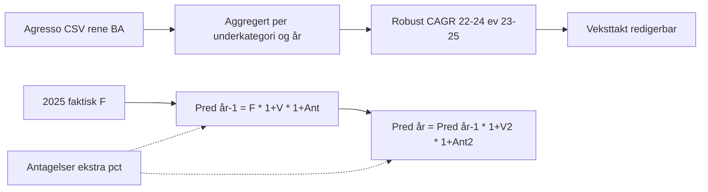

# Hvordan `Prediksjon_<år>_Økonomi.xlsx` er utregnet

Filene `Prediksjon_2026_Økonomi.xlsx`, `Prediksjon_2027_Økonomi.xlsx` osv. er **offline-genererte** Excel-arbeidsbøker fra skriptet [`lag_prediksjon_excel.py`](lag_prediksjon_excel.py), basert på **Agresso CSV** (eiendomskostnader, innkjøpskategori 01). De er **ikke** den samme som backend-eksporten `prediksjon_2027_export.xlsx` (Holt-Winters fra databasen via API).

## Kilde og omfang

| Element | Innhold |
|--------|---------|
| **Skript** | `python3 finans/lag_prediksjon_excel.py --out-year <år>` → skriver `finans/Prediksjon_<år>_Økonomi.xlsx` |
| **Rådata** | `finans/Eiendom 202001 til 202512 til Øystein(AGRESSO).csv` (semikolon-separert, latin-1) |
| **Fokus** | Agresso GL, **Innkjøpskategori 01** (leie av lokaler m.m.); forsiden beskriver historikk-vindu 2020–2025 der det er relevant |
| **BA-filter** | Kun «rene» BA-koder: `IV`, `IW`, `LE`, `H1`, `H2`, `HB`, `RE` — **MV/MP er utelatt** fra hovedtabellene (egen note + fane for MV/MP) |

## Kjerne-metode: CAGR + to-stegs prediksjon

Historikk for underkategoriene (faste navn i koden): *Husleie*, *Drift- og vedlikeholdskostnader*, *Utskiftings- og utviklingskostnader*, *Forsyningskostnader*, *Renholdstjenester*. År i hovedtabellen: **2022–2025**.

### 1) Robust CAGR (2022→2024)

- Standard vekst: `CAGR = (V_2024 / V_2022)^(1/2) - 1` over 2 år (`robust_cagr` i skriptet).
- **Outlier-justering**: Hvis 2022 er > 1,3× medianen av 2023–2025, vurderes alternativet **2023→2025** — det brukes bare hvis det gir **høyere** CAGR enn standard (reduserer effekten av engangs-topper i 2022).
- Implementasjon: `_er_outlier_2022`, `cagr_22_24` i `lag_prediksjon_excel.py` (ca. linje 147–176).

### 2) Ark «Antagelser» (globale brytere)

To **gule celler** (standard 0 %) gir *ekstra* vekst som gjelder **alle** underkategorier og **Prediksjon per eiendom**:

- én verdi for første prediksjonssteg (år før prediksjonsår),
- én for andre steg (prediksjonsår).

De multipliseres inn etter rad-vekst: `(1 + blå vekst) × (1 + ekstra fra Antagelser)`.

### 3) Excel-formler på prediksjonsarket (`Prediksjon_<år>`)

For hver underkategori:

- **Veksttakt** for «år før prediksjon» og for **prediksjonsår** fylles inn fra CAGR-grunnlaget i **gule celler** — **kan overstyres manuelt**.
- **Prediksjon år før prediksjon**: `=F*(1+H)*(1+Antagelser!$B$6)` (referanser kan avvike én rad avhengig av layout).
- **Prediksjon prediksjonsår**: `=I*(1+K)*(1+Antagelser!$B$7)`.

**Forside** henter «Totalkostnad 2025» og hovedtall for siste prediksjonsår som **formler** mot prediksjonsarket. Historikk-tabellen på Forside **peker på** cellene i `Prediksjon_<år>` (2022–2025), så du redigerer i praksis på prediksjonsarket; totalrad og andeler på Forside oppdateres via SUM og enkle CAGR-formler. Totalrad på prediksjonsarket for historikk er **SUM** av datarader.

Totallinje: SUM over prediksjonskolonnene.



## Andre ark i samme workbook

Skriptet bygger flere faner (forside, prediksjon, region, konto, leverandør, MV/MP, SRS, anlegg, **Prediksjon per eiendom** (Dim1), tilbakemelding, metodebeskrivelse m.m.). **Per eiendom** bruker tilsvarende CAGR-logikk på koststed-nivå (se skriptet ca. linje 787–863 og metode-tekst i generert Excel).

## Forskjell fra backend (KnowMe / BEFS)

| Kilde | Innhold |
|-------|---------|
| `backend/app/services/financials/prediksjon_2027_export.py` + `GET …/prediksjon-2027/export.xlsx` | Holt-Winters / syntetisk budsjett fra **PostgreSQL** (`Budget`, `GLTransaction`), med inflasjon og regionfaktorer i Excel |
| **`Prediksjon_<år>_Økonomi.xlsx`** | **CSV-basert CAGR-modell** for økonomisjekk, generert lokalt uten API |

## Regenerere filen

Etter oppdatering av CSV:

```bash
python3 finans/lag_prediksjon_excel.py --out-year 2027
```
